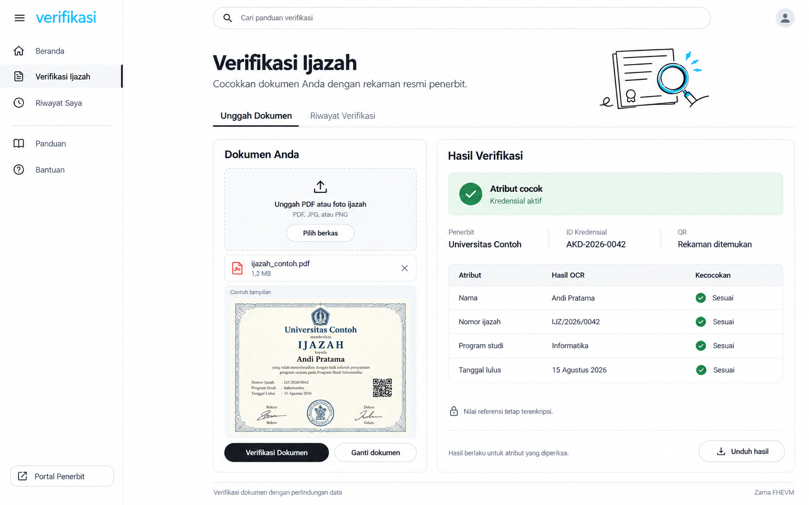

# PRD: Sistem Verifikasi Ijazah

| Identitas | Keterangan |
| --- | --- |
| Nama kerja produk | **verifikasi** |
| Versi | 1.2 |
| Tanggal | 24 September 2026 |
| Fokus | Penerbitan kredensial bertanda tangan digital, verifikasi rekaman melalui QR, dan pemeriksaan dokumen melalui OCR/FHE |
| Judul kerja penelitian | Perancangan dan Implementasi Sistem Verifikasi Ijazah Berbasis Blockchain dengan Pengikatan QR dan Pencocokan Atribut Terenkripsi Menggunakan OCR dan Zama FHEVM |
| Folder proyek | `verifikasi-ijazah` |
| Target awal | Prototipe fungsional pada testnet |
| Arsitektur repositori | **Monorepo wajib untuk seluruh kode dan semua AI agent** |
| Tech stack yang dipertahankan | Next.js/React/TypeScript/Tailwind di Vercel, Supabase PostgreSQL + Drizzle ORM, Vercel Blob privat, Vercel Workflow, OCR TypeScript in-process (tesseract.js, MuPDF.js, zxing-wasm; menggantikan Docker OCR Python sejak 25 September 2026), Solidity/Hardhat/Zama FHEVM |
| Pedoman agen | `CLAUDE.md` di root monorepo |
| Jalur utama | Kamera/pemindai QR bawaan HP membuka web resmi, tanpa unggah dokumen |
| Jalur tambahan | Unggah PDF/foto/scan untuk pencocokan otomatis melalui OCR dan Zama FHEVM |

## 1. Ringkasan produk

Platform memungkinkan kampus mengesahkan data kredensial dengan tanda tangan digital yang terintegrasi blockchain. Ijazah cukup menampilkan QR menuju halaman resmi kredensial. Pemeriksa memindai QR menggunakan kamera atau fitur QR bawaan HP; web langsung memverifikasi bukti penerbitan dan menampilkan rekaman resmi tanpa mewajibkan login, wallet, izin kamera web, atau unggahan dokumen.

Pada jalur utama, produk menjawab: **apakah rekaman kredensial ini benar-benar disahkan penerbit yang berwenang, terikat pada blockchain, dan masih aktif?** Pengguna membandingkan data resmi yang ditampilkan dengan ijazah di tangannya. Situs tidak mengetahui isi kertas hanya dari pembacaan QR.

Jalur tambahan menerima PDF, foto, atau hasil scan. OCR membaca atribut, lalu Zama FHEVM mencocokkan representasinya dengan referensi terenkripsi milik penerbit. Jalur ini menjawab: **apakah atribut yang terbaca pada unggahan sesuai dengan rekaman yang telah diverifikasi?** Kedua jalur tersedia pada produk, dengan hasil dan batas yang ditampilkan secara berbeda.

Objek e-sign MVP adalah **data kredensial**, bukan gambar tanda tangan atau signature yang ditanam di PDF. Model ini tidak otomatis memvalidasi seluruh byte PDF, semua unsur visual, keaslian kertas, atau kedudukan hukum suatu tanda tangan. Produk tetap berfokus pada ijazah dan tidak menjadi portal HR/rekrutmen.

## 2. Masalah yang diselesaikan

1. QR asli dapat disalin dan ditempel pada dokumen lain. Jalur utama menampilkan data asli yang dirujuk QR untuk dicocokkan manusia; jalur tambahan memeriksa atribut unggahan secara otomatis.
2. Hash seluruh berkas berubah setelah scan, foto, kompresi, atau penyimpanan ulang. Perbedaan hash tidak otomatis menunjukkan pemalsuan.
3. Informasi yang ditampilkan pada halaman publik memang dapat dibaca pengunjung. Produk harus memisahkan profil publik yang disetujui penerbit dari atribut yang tetap privat; FHE tidak membuat data yang sudah dipublikasikan menjadi rahasia.
4. OCR dapat salah membaca teks. Produk harus memisahkan ketidaksesuaian atribut, ketidakpastian pembacaan, dan kegagalan teknis.

## 3. Tujuan dan cakupan MVP

### 3.1 Tujuan

- Memungkinkan scan QR dari kamera HP langsung membuka hasil verifikasi rekaman, tanpa langkah unggah wajib.
- Mengesahkan data kredensial dengan tanda tangan digital dan mengikat bukti tersebut ke blockchain.
- Menyediakan pencocokan empat atribut melalui unggahan sebagai pemeriksaan tambahan.
- Memeriksa kewenangan kampus dan status pencabutan pada blockchain.
- Menggunakan komputasi FHE untuk pencocokan dengan referensi terenkripsi.
- Menghasilkan penjelasan yang dapat dipahami pengguna tanpa harus memahami wallet atau kriptografi.
- Menghadirkan UI yang mengikuti gambar yang telah disetujui pengguna pada bagian 9.
- Mengelola seluruh implementasi dalam monorepo yang terstruktur, termasuk setiap file kode baru yang dibuat AI agent.

### 3.2 Termasuk MVP

Registrasi penerbit dan wallet penandatangan, pengesahan data kredensial, pemeriksaan signature saat penerbitan, pengikatan ke blockchain, QR, halaman verifikasi rekaman publik, pencabutan, serta jalur unggahan dengan OCR, normalisasi, perbandingan FHE, hasil per atribut, laporan, riwayat sementara, dan panduan.

**Unggahan opsional bagi pemeriksa, tetapi implementasi jalur OCR/FHE tetap wajib dalam MVP penelitian.** Pengguna yang hanya memindai QR langsung memperoleh hasil verifikasi rekaman dan data publik. Pilihan **Periksa dokumen lebih lanjut** membuka jalur unggahan tanpa menghambat jalur utama.

### 3.3 Di luar MVP

Portal HR, skor kandidat, marketplace/NFT, gambar tanda tangan, penandatanganan atau validasi signature PDF/PKI/PAdES, klaim tanda tangan elektronik tersertifikasi, koneksi otomatis PDDikti, seluruh format ijazah nasional, OCR di dalam FHEVM, pembuktian kriptografis kebenaran OCR, dan deployment produksi. E-sign atas data kredensial termasuk MVP. Pemindai kamera di dalam web hanya peningkatan opsional; pemindai bawaan HP sudah mendukung alur utama.

### 3.4 Asumsi implementasi awal

| Asumsi | Keputusan prototipe |
| --- | --- |
| Cakupan penerbit | Minimal satu kampus contoh yang diotorisasi administrator |
| Format dokumen | Dua template ijazah uji yang ditetapkan dan diberi versi |
| Pengguna pemeriksa | Sesi anonim yang aman, tanpa wallet dan tanpa akun wajib |
| E-sign prototipe | Pesan data kredensial EIP-712 ditandatangani wallet EOA pejabat kampus yang terdaftar |
| Profil publik awal | Nama, nomor ijazah, program studi, penerbit; tanggal lulus tidak ditampilkan secara default |
| Biaya transaksi | Penerbitan/pencabutan oleh wallet kampus; pencocokan dokumen oleh relayer testnet; scan QR hanya membaca rekaman |
| Atribut wajib | Nama, nomor ijazah, program studi, tanggal lulus |
| Batas unggahan | PDF/JPG/PNG, maksimum 10 MiB, maksimum 5 halaman, satu ijazah per pekerjaan |
| Bahasa OCR | Indonesia dan Inggris |
| Kebijakan confidence OCR (revisi pengguna 5 Oktober 2026) | Ambang 0,70; confidence menghentikan proses hanya jika keempat atribut wajib semuanya di bawah ambang. Satu atribut tepat atau di atas 0,70 cukup untuk melewati gate confidence; angka ini bukan probabilitas benar |
| Retensi unggahan pemeriksa | Maksimum 1 jam setelah pekerjaan terminal, dengan batas keras 24 jam sejak unggah |
| Riwayat sesi | Metadata minimal maksimum 24 jam; isi OCR tidak disimpan setelah TTL unggahan |
| Rekaman penerbitan | Payload bertanda tangan dan profil publik dipertahankan sebagai rekaman penerbitan, terpisah dari TTL unggahan pemeriksa |

Nilai kapasitas dan retensi di atas adalah konfigurasi awal. Kebijakan confidence telah ditetapkan pengguna pada 5 Oktober 2026, menggantikan ambang awal 0,90 per atribut. Kebijakan ini bukan hasil kalibrasi akurasi; klaim keandalan tetap memerlukan pengukuran dokumen uji. Setiap perubahan aturan pembacaan dicatat dalam versi konfigurasi OCR.

### 3.5 Ketentuan wajib monorepo

**Seluruh proyek wajib menggunakan monorepo sejak inisialisasi sampai pemeliharaan. Aturan ini berlaku bagi seluruh AI agent dan pengembang ketika membuat, memindahkan, atau mengubah file kode. Setiap file harus ditempatkan pada aplikasi atau modul yang memiliki tanggung jawabnya.**

Kewajiban ini mencakup frontend, API, paket OCR, smart contract, pustaka bersama, script, prototype, dan pengujian. Pemisahan runtime atau deployment diperbolehkan dengan kode tetap di satu repositori. Monorepo merupakan persyaratan pengguna yang wajib, bukan asumsi prototipe. Struktur dan prosedurnya ditetapkan pada bagian 10.5 sampai 10.7.

## 4. Aktor dan hak akses

| Aktor | Hak utama | Pembatasan |
| --- | --- | --- |
| Pemeriksa | Memindai QR dan melihat rekaman publik; memilih unggahan tambahan, melihat hasil milik sesinya, mengunduh laporan, menghapus unggahan | Tidak membaca referensi privat dalam plaintext atau pekerjaan sesi lain |
| Operator kampus | Menerbitkan kredensial, memperoleh QR, mencabut kredensial milik kampus | Wallet harus terdaftar; tidak mengubah rekaman kampus lain |
| Pejabat penandatangan | Meninjau data dan publikasinya, lalu menandatangani payload kredensial | Wallet terikat pada kampus dan kewenangan yang terdaftar; peran dapat dirangkap operator pada prototipe |
| Administrator platform | Memverifikasi dan mengaktifkan penerbit, menonaktifkan kewenangan, mengelola konfigurasi | Tidak otomatis memperoleh izin dekripsi atribut referensi |
| Layanan OCR/attestor | Membaca unggahan, mengekstrak atribut, mengikat hasil pada pekerjaan | Tidak menjadi penerbit akademik |
| Relayer dan pembaca hasil | Mengirim transaksi yang sah, mendekripsi hasil perbandingan yang diizinkan | Tidak mendapat izin dekripsi referensi penerbit |

Kebenaran identitas institusi ditetapkan melalui proses onboarding administratif, bukan sekadar kampus memasukkan nama sendiri. Login portal dan otorisasi wallet harus konsisten; hak kontrak tetap menjadi pemeriksaan wajib.

## 5. Alur pengguna

### 5.1 Penerbitan oleh kampus

1. Administrator memeriksa identitas kampus serta mendaftarkan wallet pejabat yang berwenang menandatangani dan menerbitkan kredensial.
2. Kampus mengisi empat atribut resmi. Aplikasi memvalidasi data, menyiapkan credential ID acak, dan memperlihatkan informasi yang akan tampil di halaman publik.
3. Sistem membentuk snapshot publik serta referensi atribut terenkripsi dengan skema dan encoding yang sama. Pejabat meninjau data, tujuan pengesahan, dan publikasinya.
4. Wallet pejabat menandatangani payload kredensial EIP-712. Payload mengikat credential ID, kampus, snapshot publik, referensi terenkripsi, versi skema, dan domain jaringan/kontrak.
5. Wallet yang sama mengirim transaksi penerbitan beserta payload, signature, dan input FHE. Kontrak memeriksa kewenangan, signature kredensial, input proof, nonce, deadline penerbitan, dan keunikan ID sebelum menyimpan bukti serta status aktif.
6. Setelah konfirmasi blockchain dan ketersediaan payload publik terverifikasi, sistem menghasilkan QR berupa URL resmi `/c/{credentialId}`. QR tidak berisi plaintext atribut privat.
7. Kampus mencantumkan QR pada ijazah dan menyerahkannya kepada lulusan. Gambar tanda tangan tidak diperlukan; bukti digital berada pada data kredensial.
8. Koreksi dilakukan melalui pencabutan dan penerbitan ID baru. Perubahan nama/nomor pada database tidak boleh mengubah rekaman yang telah disahkan.

Pengesahan pesan kredensial dan pengiriman transaksi merupakan tindakan kriptografis dengan fungsi berbeda. Signature transaksi saja tidak cukup sebagai implementasi e-sign yang dimaksud PRD ini; payload kredensial juga wajib memiliki signature yang diverifikasi.

### 5.2 Jalur utama: scan QR langsung ke web

1. Pemeriksa memindai QR menggunakan kamera atau pemindai QR bawaan HP.
2. Browser membuka `/c/{credentialId}` pada origin resmi. Tidak ada kewajiban unggah, login, menghubungkan wallet, atau memberikan izin kamera kepada web.
3. Web mengambil payload kredensial beserta signature dan membaca rekaman blockchain dari konfigurasi jaringan/kontrak resmi.
4. Sistem memeriksa integritas snapshot publik, signature pejabat, keterikatan payload dengan bukti on-chain, kewenangan penerbit, dan status pencabutan saat diperiksa.
5. Halaman menampilkan hasil rekaman beserta penerbit, nama, nomor ijazah, program studi sesuai kebijakan publik, dan waktu pemeriksaan. Label **Rekaman ijazah terverifikasi** hanya tampil jika seluruh syarat terpenuhi dan kredensial aktif; pencabutan memakai label **Kredensial dicabut**.
6. Pemeriksa mencocokkan informasi tersebut dengan dokumen di tangannya. Web tidak menganggap isi dokumen sudah dibandingkan secara otomatis.
7. Jika diperlukan, pemeriksa memilih **Periksa dokumen lebih lanjut** untuk masuk ke jalur unggahan.

Jika QR Andi ditempel pada ijazah Budi, web tetap menampilkan rekaman Andi. Perbedaan diketahui ketika pemeriksa membandingkan informasi. QR statis dapat disalin; salinan yang seluruh atributnya sama tidak dapat dibedakan sebagai kertas asli melalui jalur ini. Web tidak menjalankan OCR, perbandingan FHE, atau transaksi blockchain baru hanya karena QR dipindai.

### 5.3 Jalur tambahan: pemeriksaan dokumen dengan OCR/FHE

1. Pengguna memilih pemeriksaan tambahan dari halaman rekaman, atau membuka halaman **Periksa Dokumen** secara langsung.
2. Pengguna mengunggah satu PDF/foto. Aplikasi menunjukkan nama, ukuran, pratinjau, dan penjelasan singkat pemrosesan data.
3. Saat **Verifikasi Dokumen** dipilih, server memvalidasi berkas, membuat pekerjaan, dan menghitung digest berkas untuk pengikatan internal.
4. Langkah OCR membaca QR dari halaman ijazah dan mengekstrak empat atribut dari dokumen yang sama. QR dari URL awal harus sama dengan QR pada unggahan.
5. Server menjalankan seluruh pemeriksaan rekaman pada jalur utama, lalu memeriksa template dan kualitas OCR. Pencocokan FHE hanya dilanjutkan jika rekaman terverifikasi dan aktif serta pembacaan memadai.
6. Atribut yang memenuhi syarat dinormalisasi dan dienkripsi, kemudian dipasangkan dengan attestation pekerjaan.
7. Kontrak memverifikasi otorisasi dan attestation, lalu menjalankan perbandingan FHE terhadap referensi terenkripsi.
8. Layanan yang berizin memperoleh hasil perbandingan, membaca ulang status kredensial dan kampus, lalu menyusun keputusan.
9. UI menampilkan status, penerbit, identitas rekaman, hasil per field, waktu pemeriksaan, serta batas hasil. Pengguna dapat mengunduh laporan atau mengganti dokumen.

Kembali ke halaman rekaman tidak memaksa pengguna menyelesaikan unggahan. Hasil jalur QR tidak boleh diubah menjadi **Atribut cocok** sebelum pekerjaan OCR/FHE benar-benar selesai.

### 5.4 QR tempelan dan dokumen hasil scan

- QR kredensial A pada dokumen dengan atribut B akan menghasilkan ketidaksesuaian jika OCR andal dan minimal satu atribut wajib berbeda.
- QR A pada salinan dengan keempat atribut A yang sama tetap dapat menghasilkan cocok. Deteksi asal kertas atau penyalinan visual berada di luar cakupan.
- PDF asli dan hasil scan dapat memiliki hash berbeda tetapi tetap cocok jika atribut terbaca dan hasil normalisasinya sama.
- Scan buram atau teks ambigu menghasilkan **Belum dapat diverifikasi**, disertai tindakan mengunggah ulang.

Pernyataan hasil pada bagian ini berlaku untuk jalur unggahan. Jalur QR tidak mengklaim ketidaksesuaian otomatis tanpa membaca dokumen. Penandatanganan data kredensial juga tidak sama dengan validasi signature pada file PDF.

## 6. Persyaratan fungsional

| ID | Prioritas | Persyaratan |
| --- | --- | --- |
| FR-01 | P0 | Administrator mendaftarkan dan menonaktifkan penerbit; perubahan tercatat |
| FR-02 | P0 | Kampus mengesahkan payload kredensial bertanda tangan digital yang mengikat profil publik dan empat referensi terenkripsi ke credential ID unik |
| FR-03 | P0 | Kampus mencabut kredensial miliknya; pencabutan tidak dapat dibatalkan dalam MVP |
| FR-04 | P0 | QR hanya berisi rujukan berformat tetap, tanpa nama atau nomor ijazah plaintext |
| FR-05 | P0 | Unggahan, drag-and-drop, pratinjau, ganti, dan hapus berkas berfungsi |
| FR-06 | P0 | Server memvalidasi signature/MIME berkas, ukuran, halaman, dan kemampuan parsing; PDF berpassword ditolak dengan alasan |
| FR-07 | P0 | QR wajib ditemukan pada halaman ijazah; QR asing, lebih dari satu kandidat rekaman, atau QR ambigu tidak dipilih diam-diam |
| FR-08 | P0 | OCR mengeluarkan teks, kandidat atribut, confidence, posisi halaman, serta versi konfigurasi |
| FR-09 | P0 | Empat atribut wajib memenuhi syarat pembacaan dan normalisasi sebelum pencocokan resmi |
| FR-10 | P0 | Attestation mengikat pekerjaan, unggahan, rekaman tujuan, dan input terenkripsi; browser tidak dapat mengganti nilai OCR |
| FR-11 | P0 | Pencocokan FHE menghasilkan hasil per field dan gabungan, dengan dekripsi yang dibatasi |
| FR-12 | P0 | Pekerjaan asinkron, polling, retry idempoten, dan status teknis terlihat oleh pengguna |
| FR-13 | P0 | Keputusan mengikuti tabel pada bagian 7; tidak ada label otomatis "palsu" |
| FR-14 | P0 | Laporan PDF unduhan memuat bukti konteks dan batas keputusan; unduhan hanya untuk sesi pemilik |
| FR-15 | P0 | Riwayat sementara menampilkan pekerjaan sesi sendiri dan menghormati TTL |
| FR-16 | P0 | Panduan membedakan verifikasi rekaman lewat QR, perbandingan manual, pencocokan OCR/FHE, e-sign data, dan batas tiap hasil |
| FR-17 | P1 | Kamera di dalam aplikasi untuk scan QR dan unggahan foto langsung |
| FR-18 | P1 | Tambahan template kampus dan akun opsional untuk riwayat persisten dengan persetujuan tersendiri |
| FR-19 | P0 | QR hasil penerbitan membuka halaman rekaman langsung melalui kamera HP tanpa unggahan, login, wallet, atau kamera web |
| FR-20 | P0 | Kontrak memverifikasi signature payload kredensial, kewenangan penandatangan, binding data, nonce, deadline, dan domain sebelum penerbitan |
| FR-21 | P0 | Halaman publik memeriksa signature dan kecocokan payload dengan bukti blockchain sebelum menyebut data sebagai rekaman terverifikasi |
| FR-22 | P0 | Data publik mengikuti profil pengungkapan bertanda tangan; atribut privat dan ciphertext referensi tidak didekripsi untuk mengisi halaman publik |
| FR-23 | P0 | Hasil verifikasi rekaman dan hasil pencocokan dokumen memiliki status serta cakupan yang berbeda pada UI, API, dan laporan |
| FR-24 | P0 | Tombol pemeriksaan tambahan membawa credential ID sebagai konteks; QR unggahan wajib sesuai dengan rekaman tujuan |

P0 diperlukan untuk MVP lengkap. OCR/FHE tetap P0 sebagai kemampuan produk walaupun pengguna tidak wajib memakainya pada setiap pemeriksaan. P1 tidak menghalangi penyelesaian MVP dan tidak boleh menggantikan pekerjaan P0.

## 7. Status dan aturan keputusan

### 7.1 Hasil verifikasi rekaman pada kedua jalur

API menyertakan `mode: RECORD` atau `mode: DOCUMENT`. `recordVerificationStatus` dipakai pada kedua jalur; `documentDecision` bernilai `null` pada jalur QR. Jangan menyamakan rekaman yang sah dengan dokumen fisik yang sudah dibandingkan.

| Status rekaman | Kondisi | Teks UI |
| --- | --- | --- |
| `VERIFIED_RECORD` | Signature kredensial valid, snapshot sesuai bukti on-chain, penerbit berwenang, kredensial aktif | **Rekaman ijazah terverifikasi** |
| `REVOKED` | Kredensial yang dirujuk telah dicabut | **Kredensial dicabut** |
| `NOT_FOUND` | Pembacaan chain berhasil, credential ID tidak ditemukan | **Rekaman tidak ditemukan** |
| `INVALID_PROOF` | Payload/signature tidak cocok, signer tidak sesuai, atau profil publik berbeda dari bukti on-chain | **Bukti kredensial tidak valid** |
| `ISSUER_INACTIVE` | Kewenangan penerbit saat ini dinonaktifkan | **Kewenangan penerbit tidak aktif** |
| `PENDING` | Penerbitan belum terkonfirmasi menurut kebijakan jaringan | **Penerbitan belum selesai** |
| `ERROR` | RPC atau penyedia payload tidak tersedia sehingga pemeriksaan belum dapat dituntaskan | **Verifikasi rekaman terganggu** |

Data profil yang gagal pemeriksaan integritas tidak boleh ditampilkan sebagai data resmi. Halaman rekaman menampilkan cakupan **Rekaman penerbit; kecocokan isi dokumen diperiksa oleh pengguna**. Pencabutan/kewenangan nonaktif tidak membuktikan signature kriptografisnya rusak; tampilkan sebab status secara terpisah.

### 7.2 Hasil jalur unggahan

Status pekerjaan berbeda dari keputusan verifikasi. Pekerjaan bergerak melalui `RECEIVED`, `EXTRACTING`, `AWAITING_CHAIN`, `AWAITING_DECRYPTION`, lalu `COMPLETED`. Gangguan teknis memakai `FAILED`; pekerjaan yang melewati batas waktu memakai `EXPIRED`. Pekerjaan yang berhenti karena QR/OCR tidak memadai tetap dapat `COMPLETED` dengan keputusan `INCONCLUSIVE`.

| Keputusan | Kondisi | Teks UI dan tindakan |
| --- | --- | --- |
| `MATCH` | Rekaman `VERIFIED_RECORD`, OCR memenuhi seluruh syarat pembacaan termasuk kebijakan confidence, dan keempat atribut cocok menurut hasil FHE | **Atribut cocok**; subteks **Kredensial aktif**; unduh hasil |
| `MISMATCH` | Rekaman aktif dan sah, OCR memenuhi syarat pembacaan, minimal satu atribut wajib berbeda menurut FHE | **Ditemukan ketidaksesuaian**; tunjukkan field berbeda, sarankan periksa unggahan atau hubungi penerbit |
| `REVOKED` | Rekaman ditemukan dan status resminya dicabut | **Kredensial dicabut**; tampilkan waktu/status pencabutan yang tersedia |
| `NOT_FOUND` | QR valid secara format, pencarian berhasil, tetapi rekaman tidak ditemukan | **Rekaman tidak ditemukan**; jelaskan bahwa dokumen tidak dapat diverifikasi melalui platform ini |
| `INVALID_PROOF` | Bukti kredensial gagal pada pemeriksaan rekaman | **Bukti kredensial tidak valid**; tidak meneruskan pencocokan terhadap referensi yang belum sah |
| `INCONCLUSIVE` | QR/OCR tidak memadai, template tidak didukung, identitas tujuan berbeda, atau kewenangan kampus belum dapat dikonfirmasi | **Belum dapat diverifikasi**; tampilkan alasan dan langkah perbaikan |
| `ERROR` | RPC, OCR, penyimpanan, transaksi, atau dekripsi gagal secara teknis | **Layanan verifikasi terganggu**; retry aman tanpa mengarang keputusan |

Status dicabut mengalahkan kecocokan atribut. Penerbit yang dinonaktifkan atau penerbitan yang masih pending menghasilkan `INCONCLUSIVE` pada jalur dokumen dan tidak boleh menghasilkan `MATCH`. Gangguan pembacaan chain tidak boleh ditafsirkan sebagai `NOT_FOUND`. Rekaman tetap diperiksa ulang setelah FHE selesai agar pencabutan saat pekerjaan berlangsung tidak terlewat.

Field hasil memakai `MATCH`, `MISMATCH`, atau `NOT_COMPARED`. Gate confidence memakai kebijakan **semua atribut di bawah 70%**: hanya jika keempat skor valid semuanya <0,70 pekerjaan berakhir `INCONCLUSIVE` sebelum reservasi anggaran relayer dan transaksi pencocokan. Satu skor tepat atau di atas 0,70 mengizinkan pencocokan, sekalipun skor lain rendah atau rata-ratanya di bawah 0,70. Rata-rata dan minimum seluruh field tidak menjadi gate tambahan.

Keempat teks tetap wajib tersedia, memiliki satu kandidat, dapat dinormalisasi, dan berasal dari halaman yang sama dengan QR. Confidence setiap field harus numerik, finite, dan dalam rentang 0–1. Pelanggaran syarat ini tetap menghasilkan `INCONCLUSIVE`. UI menandai skor field <70% sebagai informasi pembacaan rendah, tanpa menetapkan keputusan dari satu skor. Confidence rendah dan `MISMATCH` tidak otomatis menyatakan dokumen palsu.

Laporan mencantumkan waktu dan blok status terakhir yang dipakai. Pemeriksaan ulang dapat berubah setelah pencabutan. Klik ulang tombol selama pekerjaan berjalan tidak membuat transaksi kedua.

## 8. Data, OCR, dan normalisasi

### 8.1 Skema `academic-diploma-v1`

| Field | Wajib | Aturan kanonis |
| --- | --- | --- |
| `full_name` | Ya | Unicode NFC, trim, gabungkan whitespace berulang, huruf besar; tanda baca dan diakritik dipertahankan |
| `diploma_number` | Ya | Unicode NFC, trim, huruf besar; separator dan whitespace internal dipertahankan |
| `study_program` | Ya | Unicode NFC, trim, gabungkan whitespace berulang, huruf besar; tidak mengubah alias program |
| `graduation_date` | Ya | Parse tanggal yang tidak ambigu, lalu simpan sebagai `YYYY-MM-DD`; nilai kalender harus valid |

Contoh: `  Andi   Pratama ` menjadi `ANDI PRATAMA`; `15 Agustus 2026` menjadi `2026-08-15`. `03/04/2026` hanya diterima jika template menetapkan format tanggal secara eksplisit. `Informatika` tidak otomatis dianggap sama dengan `Teknik Informatika`.

Normalisasi harus memakai implementasi bersama dan test vector yang sama. Jangan menghapus karakter substantif untuk meningkatkan angka kecocokan. Jangan menyediakan koreksi manual nilai OCR oleh pemeriksa pada jalur resmi MVP.

Pada PDF, sumber OCR adalah hasil render halaman yang terlihat, bukan text layer tersembunyi. Untuk MVP, QR dan empat atribut harus berada pada satu halaman ijazah yang sama; halaman pendukung tidak digabungkan menjadi identitas baru. Simpan nomor halaman yang diperiksa. Jika lebih dari satu halaman memenuhi kandidat ijazah atau atribut tersebar di beberapa halaman, hasilnya `INCONCLUSIVE` sampai format tersebut didukung secara eksplisit.

### 8.2 Representasi terenkripsi

Untuk setiap field, bentuk payload dengan encoding yang memiliki batas elemen jelas, misalnya `abi.encode(domain, credentialId, schemaVersion, fieldKey, canonicalValue)`. Gunakan domain `VERIFIKASI_IJAZAH_ATTR_V1`, kemudian hitung SHA-256 dan enkripsikan digest 256 bit. Ini rancangan aplikasi, bukan algoritma kriptografi baru.

Baseline adalah satu `euint256` per field dan `FHE.eq` untuk kesetaraan. Buktikan dukungan tipe serta input SDK pada versi yang dipakai sebelum implementasi dilanjutkan. Fallback kompatibilitas adalah empat limb `euint64` per digest, urutan big-endian tetap, dengan AND keempat kesetaraan. Digest tidak dipotong. Pilihan encoding dicatat pada `encodingVersion` dan harus identik saat menerbitkan serta memverifikasi.

Digest atribut yang belum dienkripsi tidak dipublikasikan. Perbandingan ciphertext dilakukan oleh operasi FHE, bukan dengan membandingkan handle. Referensi berisi fingerprint atribut terenkripsi, bukan berkas PDF terenkripsi. Operasi komputasi mengikuti mekanisme protokol Zama, termasuk coprocessor; OCR tetap berjalan pada backend aplikasi. Lihat rujukan [Z1], [Z2], dan [Z3].

### 8.3 Penyimpanan

| Lokasi | Data |
| --- | --- |
| Blockchain | Registry penerbit/penandatangan, credential ID, digest payload e-sign, hash profil publik, komitmen referensi terenkripsi, handle referensi, versi skema, status, blok/waktu pencatatan, serta commitment pekerjaan dokumen |
| Supabase PostgreSQL melalui Drizzle ORM | Payload penerbitan dan signature, profil publik yang disahkan, katalog penerbit, sesi, metadata pekerjaan dokumen, referensi transaksi, dan metadata audit minimal |
| Vercel Blob privat | Berkas unggahan, pratinjau, hasil OCR, input proses, dan laporan sementara |
| Browser | Pilihan berkas dan tampilan hasil sesi; tidak menyimpan private key layanan |

Metadata blockchain tetap dapat diamati, termasuk alamat penerbit dan pola transaksi. Ciphertext on-chain tidak dapat dihapus hanya dengan menghapus unggahan. Penghapusan di aplikasi berlaku untuk data off-chain sesuai kebijakan, bukan penghapusan riwayat blockchain.

### 8.4 Profil publik dan atribut privat

Baseline prototipe menampilkan nama, nomor ijazah, program studi, dan identitas penerbit pada halaman QR. Tanggal lulus tidak dipublikasikan secara default dan tetap dapat dibandingkan melalui jalur OCR/FHE. Ini keputusan pengungkapan awal yang harus terlihat pada pratinjau penerbitan; perubahan profil harus diberi versi dan ikut disahkan.

Profil publik merupakan snapshot yang diikat oleh signature dan hash on-chain. Halaman tidak mengambil nama dari parameter URL, input pengunjung, atau hasil OCR untuk mengganti identitas resmi. Jika QR Andi disalin, profil yang muncul tetap profil Andi.

**Data yang ditampilkan publik memang terbuka.** Enkripsi salinan referensi nama yang sudah dipublikasikan tidak membuat nama tersebut rahasia. Manfaat kerahasiaan FHE berlaku pada atribut yang tidak dipublikasikan dan pembatasan akses komputasinya. Jangan menampilkan seluruh PDF asli atau atribut tambahan di luar daftar pengungkapan.

Jangan mempublikasikan hash plaintext atribut privat yang dapat ditebak. `publicDataHash` hanya mengikat snapshot yang memang disetujui untuk publikasi, sedangkan komitmen atribut privat dibentuk dari handle ciphertext. Dataset uji harus menyertakan setidaknya satu atribut yang tetap privat agar demonstrasi kerahasiaan sesuai dengan rancangan.

## 9. Acuan UI yang wajib diikuti

### 9.1 Rujukan gambar pengguna

**Pengguna meminta UI dan karakter tipografi mengikuti gambar yang telah disetujui dalam percakapan. Gambar berikut adalah acuan visual utama implementasi, bukan sekadar inspirasi opsional.**

**Acuan utama:** `assets/ui-reference.png`, mockup Verifikasi Ijazah dengan sidebar, panel unggah, dan panel hasil. Komposisi dua panel digunakan pada jalur pemeriksaan tambahan. Halaman rekaman yang dibuka melalui QR memakai font, warna, komponen, dan karakter visual yang sama, dengan data resmi langsung tampil tanpa dropzone wajib. **Acuan pendukung:** [screenshot Kaggle yang diberikan pengguna](assets/kaggle-style-reference.png), untuk tipografi, whitespace, navigasi, outline, dan aksen warna. Gunakan paket ZIP agar kedua gambar tetap berada pada path relatif yang benar.

Implementasi harus mempertahankan hierarki dan karakter gambar utama. Gambar bukan aplikasi siap pakai; setiap tombol, status, unggahan, dan tabel harus menjadi komponen yang berfungsi. Nama kampus, nama lulusan, ID, dan status hijau pada gambar merupakan data contoh. Tidak ada kewajiban menggunakan nilai contoh itu pada data nyata.

Jika detail ilustrasi bertentangan dengan keamanan, aksesibilitas, atau aturan hasil pada PRD, sesuaikan detail tersebut sambil mempertahankan struktur visual. Jangan menyalin logo Kaggle atau memasukkan konten kompetisi/benchmark.

### 9.2 Struktur layar pemeriksaan tambahan

1. **Sidebar:** wordmark cyan `verifikasi`; Beranda, Verifikasi Ijazah, Riwayat Saya, Panduan; akses Portal Penerbit di bawah. Navigasi aktif memiliki latar abu-abu sangat muda dan garis penanda hitam.
2. **Topbar:** pencarian panduan berbentuk pill dan tombol **Masuk dengan wallet** untuk pejabat penerbit (hubungkan wallet lalu tandatangani pesan masuk; setelah masuk menampilkan alamat dan kelola wallet). Tombol ini opsional; pemeriksa tidak perlu login. Kode wallet hanya dimuat untuk portal, saat tombol diklik, atau bila browser pernah terhubung, sehingga halaman QR tetap ringan.
3. **Judul:** `Verifikasi Ijazah`, dengan subjudul `Cocokkan dokumen Anda dengan rekaman resmi penerbit.` Ilustrasi sertifikat dan kaca pembesar memakai garis navy dengan aksen biru, sama dengan set ikon.
4. **Tab:** `Unggah Dokumen` dan `Riwayat Verifikasi`, dengan garis bawah hitam pada tab aktif. Riwayat sidebar dan tab membuka data sesi yang sama.
5. **Panel kiri, Dokumen Anda:** dropzone, keterangan format, tombol Pilih berkas, nama/ukuran berkas, pratinjau, tombol Verifikasi Dokumen dan Ganti dokumen.
6. **Panel kanan, Hasil Verifikasi:** status, ringkasan penerbit/ID/QR, tabel atribut, keterangan privasi, batas keputusan, dan Unduh hasil.
7. **Footer:** kalimat singkat tentang perlindungan data dan label teknologi Zama FHEVM yang tidak mendominasi.

### 9.3 Token desain awal

Nilai berikut menerjemahkan gambar menjadi panduan implementasi. Angka adalah baseline desain, bukan hasil pengukuran piksel atau identifikasi font asli Kaggle.

| Elemen | Spesifikasi |
| --- | --- |
| Font | Hind, fallback Segoe UI, Arial, dan sans-serif; bobot 400, 500, 600, 700 |
| Judul halaman | 36 sampai 40 px desktop, 28 px mobile; bobot 700 |
| Judul panel | 20 sampai 22 px; bobot 700 |
| Teks utama | 14 sampai 16 px; line-height 1,5 |
| Latar | Putih `#FFFFFF` |
| Teks utama/sekunder | `#111827` / `#64748B` |
| Border | `#E2E8F0`, ketebalan 1 px |
| Aksen merek | Cyan `#20BEFF`; tidak dipakai sebagai teks kecil yang rendah kontras |
| Tombol utama | Latar `#17191D`, teks putih, radius pill |
| Tombol sekunder | Putih, outline abu-abu, teks gelap |
| Status cocok | Latar `#EAF7EF`, teks/ikon `#18794E` |
| Status perhatian | Latar `#FFF7E6`, teks `#8A4B00` |
| Status dicabut/error | Latar `#FDECEC`, teks `#B42318`; label membedakan masalah kredensial dan masalah teknis |
| Panel | Radius 12 sampai 16 px, tanpa bayangan berat |
| Grid desktop | Sidebar sekitar 240 px; konten maksimal sekitar 1140 px; dua panel sekitar 38:62, gap 20 px |
| Spacing | Kelipatan 4/8 px, padding panel sekitar 24 px |
| Ikon | SVG dua warna: garis navy `#0F1A3A`, aksen biru `#0E94F7`, isian biru muda `#E2F3FF`; satu warna di atas tombol terisi; berlabel untuk tombol yang tidak jelas |

Gunakan ilustrasi ringan dan ruang kosong. Hindari hero besar, gradien mencolok, kartu statistik yang tidak diminta, atau tampilan dashboard rekrutmen.

### 9.4 Keadaan layar dan microcopy

| Keadaan | Perilaku tampilan |
| --- | --- |
| Awal | Panel kanan menjelaskan langkah; belum ada badge hijau atau data hasil |
| Berkas dipilih | Nama, ukuran, pratinjau, ganti/hapus tersedia; tombol verifikasi aktif setelah validasi awal |
| Memproses | Tahap aktual: Membaca dokumen, Memeriksa rekaman, Mencocokkan atribut, Menyiapkan hasil; jangan membuat persentase palsu |
| Cocok | Badge sesuai gambar utama, tabel hasil, status aktif, waktu pemeriksaan, unduh |
| Tidak cocok | Tandai field yang berbeda; jangan menampilkan nilai referensi sebagai petunjuk menebak |
| OCR ambigu | Tandai teks yang perlu dibaca ulang; tindakan utama Unggah ulang |
| Gangguan teknis | Pesan pendek dan Coba lagi; input tidak hilang bila masih dalam TTL |

Tabel pada jalur unggahan berkolom **Atribut**, **Hasil OCR**, dan **Kecocokan**. Nilai Hasil OCR berasal dari unggahan pengguna. Keterangan di bawah tabel: **Nilai referensi tetap terenkripsi.** Keterangan tambahan: **Dokumen unggahan diproses oleh server untuk pembacaan OCR.** Batas hasil: **Hasil berlaku untuk atribut yang diperiksa.** Informasi publik yang memang ditampilkan pada halaman rekaman tidak boleh disebut rahasia karena ada salinan referensi terenkripsi.

### 9.5 Responsif dan aksesibilitas

Pada layar kecil, sidebar menjadi drawer, panel ditumpuk dengan unggahan di atas hasil, metadata dibungkus, dan tabel diubah menjadi baris atribut yang terbaca tanpa scroll horizontal halaman. Seluruh tindakan harus dapat digunakan dengan keyboard, memiliki label dan fokus terlihat, serta tidak mengandalkan warna saja untuk status.

Pemeriksaan visual wajib pada lebar 1600 px dan 390 px, serta uji overflow pada 360 px. Gambar acuan desktop tidak dijadikan alasan untuk mengabaikan mobile. Pencarian, Panduan, dan navigasi harus memiliki perilaku nyata; tidak boleh berupa kontrol mati.

### 9.6 Halaman rekaman dari QR dan portal penerbit

Halaman `/c/{credentialId}` merupakan halaman tujuan utama scan dari HP. Susun heading **Verifikasi Rekaman Ijazah**, status rekaman, identitas penerbit, data publik yang telah diverifikasi, status e-sign data kredensial, waktu/blok pemeriksaan, dan tautan detail bukti. Saat memuat, tampilkan **Memeriksa rekaman**, bukan proses OCR.

Instruksi yang selalu terlihat: **Cocokkan data di halaman ini dengan ijazah yang Anda periksa.** Teks cakupan: **Rekaman penerbit telah diperiksa; isi dokumen di tangan Anda belum dicocokkan otomatis.** Jangan menampilkan badge **Atribut cocok**, meminta kamera web, atau menutup data resmi dengan kewajiban unggah.

Tombol **Periksa dokumen lebih lanjut** membuka jalur unggahan dengan ID rekaman sebagai konteks. Tombol itu bersifat pilihan. Tampilan hanya memuat field publik pada profil yang disahkan; detail e-sign tidak mengungkap atribut privat.

Portal penerbit menyediakan langkah **Isi data**, **Tinjau data publik**, **Sahkan kredensial**, **Kirim penerbitan**, dan **Ambil QR**. Pisahkan status signature selesai dari transaksi terkonfirmasi. Sampai penerbitan selesai, jangan menyediakan hasil seolah kredensial sudah aktif. QR adalah satu elemen visual; tidak diperlukan gambar tanda tangan kedua.

## 10. Arsitektur dan pengikatan dokumen

### 10.1 Komponen dan tech stack yang dipertahankan

**Implementasi versi 1.2 melanjutkan tech stack yang sudah dipakai dalam repositori.** Penambahan e-sign data kredensial, halaman QR, dan pemeriksaan bukti penerbitan dilakukan di atas stack ini. Perubahan fitur membutuhkan pengembangan model data, kontrak, API, dan UI, dengan provider hosting, database, ORM, dan penyimpanan yang tetap sama.

| Komponen | Tech stack | Tanggung jawab |
| --- | --- | --- |
| Web dan API | Next.js 16 App Router, React 19, TypeScript strict, Tailwind CSS 4 | UI, sesi, unggahan, otorisasi, pemeriksaan rekaman, pekerjaan, portal kampus |
| Hosting aplikasi | Proyek Vercel Next.js (Root Directory `apps/web`) | Satu proyek Vercel berisi web, API, dan Function langkah Workflow yang menjalankan OCR; tanpa Services atau container |
| Database dan ORM | Supabase PostgreSQL, Drizzle ORM, driver `pg`, Drizzle Kit | Rekaman penerbitan, payload/signature, profil publik, sesi, metadata pekerjaan dan transaksi; schema serta migrasi database yang dilacak dalam repositori |
| Object storage | Vercel Blob dengan akses private | Unggahan langsung dari browser dengan otorisasi backend, dokumen dan artefak proses privat, penghapusan sesuai TTL |
| Orkestrasi pekerjaan | Vercel Workflow SDK dan endpoint maintenance terjadwal | Langkah OCR, pengiriman transaksi, polling/dekripsi, retry idempoten, pemulihan dan cleanup |
| OCR | Paket TypeScript `packages/ocr`: tesseract.js `ind+eng` (tessdata 4.0.0), MuPDF.js, zxing-wasm | OCR in-process di langkah Workflow: render PDF/gambar, pembacaan QR, ekstraksi dan confidence |
| Domain bersama | Paket TypeScript | Skema, normalisasi, encoding, keputusan |
| Kredensial | Paket TypeScript `packages/credentials`, ditambahkan untuk fitur versi 1.2 | Payload e-sign, hashing snapshot, verifikasi signature, dan pemeriksaan bukti penerbitan; memakai model domain bersama |
| Kontrak | Solidity, Hardhat, `@fhevm/solidity`, OpenZeppelin Contracts | Registry penerbit/penandatangan, validasi e-sign saat penerbitan, pencabutan, pemeriksaan attestation, FHE |
| Adapter chain | SDK `@zama-fhe/relayer-sdk` dan ethers, target Sepolia/Zama | Enkripsi, input proof, transaksi, polling, dekripsi berizin, serta integrasi wallet penerbit |

Versi dependency yang tepat mengikuti manifest workspace dan lockfile yang sudah ada. Monorepo memakai pnpm untuk seluruh kode JS/TS; tidak ada Python atau Docker. Kompatibilitas perubahan dependency harus diuji; konfigurasi jaringan mengikuti dokumentasi resmi Zama [Z4], dengan alamat kontrak dari deployment yang benar.

- Konfigurasi hosting berada di `apps/web/vercel.json`. OCR berjalan di Function langkah Workflow; WASM dan data bahasa ikut trace deployment. Pengembangan lokal tidak memerlukan Docker.
- Runtime database menggunakan `DATABASE_URL` Supabase Transaction pooler; migrasi Drizzle memakai `DATABASE_MIGRATION_URL` direct atau Session pooler. Migrasi dijalankan terpisah sebelum aplikasi memakai schema baru, bukan sebagai DDL saat request masuk.
- Upload 10 MiB dikirim langsung ke Blob privat melalui intent/token yang terikat sesi. Backend tetap memvalidasi byte aktual, ukuran, format, dan digest sebelum membuat pekerjaan; atribut dari browser tidak menjadi hasil OCR resmi.
- Metadata pekerjaan dan referensi transaksi tetap persisten di PostgreSQL. Workflow membawa ID dan metadata kendali; dokumen, teks OCR, atribut, dan secret tidak dimasukkan ke argumen atau hasil langkah yang tersimpan dalam riwayat Workflow. Lease relayer harus kompatibel dengan transaction pooling.
- Lokal dan Vercel sama-sama memakai Workflow dengan OCR in-process; tidak ada mode polling. Jalur QR hanya membaca serta memvalidasi bukti, sehingga tidak bergantung pada eksekusi pekerjaan OCR/FHE.
- Payload e-sign dan profil publik disimpan sebagai rekaman penerbitan yang tahan lama, terpisah dari artefak Blob sementara dan cleanup pekerjaan pemeriksa. Penyesuaian schema untuk entitas baru tetap menggunakan Drizzle.

Panduan environment, migrasi, batas paket, dan deployment mengikuti [docs/vercel.md](docs/vercel.md). Konfigurasi bawaan memakai maintenance sekali sehari agar sesuai batas cron Hobby; pemrosesan dan cleanup normal tetap dijadwalkan oleh Workflow. Batas akses artefak tidak berubah, tetapi pemulihan dan penghapusan fisik saat Workflow gagal dapat menunggu maintenance harian. Konfigurasi Hobby ini belum membuktikan target penghapusan fisik pada TTL dalam kondisi gangguan; scheduler lebih sering diperlukan bila target tersebut wajib dipenuhi. Penetapan target hosting ini tidak menyatakan deployment cloud atau alur testnet sudah terbukti berhasil.

### 10.2 Mengapa backend OCR harus dipercaya

Pemeriksa dapat memodifikasi kode browser. Jika browser bebas mengirim empat nilai atribut, ia dapat mengirim data yang berbeda dari dokumen. Karena itu, jalur resmi MVP hanya menerima unggahan, lalu backend sendiri memperoleh atribut yang akan dibandingkan.

Backend dipercaya untuk menghubungkan file, QR, dan hasil OCR. Attestation membuktikan layanan mana yang mengesahkan input, bukan membuktikan secara matematis bahwa OCR benar. Privasi FHE tidak menyembunyikan dokumen dari backend OCR yang membacanya.

### 10.3 Attestation dan anti-replay

1. Hitung SHA-256 atas byte unggahan dan buat salt pekerjaan acak 32 byte. Bentuk `uploadCommitment` dari digest dan salt dengan encoding yang tidak ambigu.
2. Setelah OCR dan enkripsi, attestor menandatangani payload terstruktur yang mencakup `requestId`, `credentialId`, `uploadCommitment`, `schemaVersion`, `encodingVersion`, `normalizerVersion`, `ocrConfigHash`, hash daftar handle input, relayer tujuan, `nonce`, dan `deadline`.
3. Gunakan domain tanda tangan yang terikat pada chain ID, alamat kontrak verifier, dan versi protokol aplikasi. Kontrak memeriksa signer berwenang, caller relayer yang dituju, deadline, nonce, dan request ID yang belum dipakai.
4. Input proof harus sesuai ciphertext, kontrak, dan alamat pengirim yang diwajibkan SDK. Kontrak memvalidasi input melalui mekanisme resmi Zama [Z1].
5. Simpan status proses dan pemetaan hasil ke request ID. Retry memeriksa transaksi yang ada sebelum mengirim ulang.

Salt dan digest berkas tersedia hanya dalam konteks pekerjaan/laporan yang berhak. Yang dipublikasikan cukup commitment pekerjaan, bukan teks OCR atau digest atribut terbuka. QR tidak menyediakan bukti attestation ini; QR hanya memilih rekaman.

### 10.4 Model akses ciphertext

Referensi terenkripsi hanya diberikan izin kepada kontrak terkait dan penerbit sesuai kebutuhan. Akun pembaca hasil memperoleh izin terbatas pada hasil perbandingan. Gunakan mekanisme ACL dan user decryption resmi [Z5]. Tidak ada public decryption dalam jalur MVP ini.

Hasil pencocokan dokumen diperoleh melalui API sesi. Pengguna mempercayai layanan OCR dan penyajian hasil perbandingan, sehingga laporan OCR/FHE tidak menjadi bukti trustless atas pembacaan dokumen. Pada jalur QR, payload publik beserta signature dan rujukan kontrak tersedia untuk pemeriksaan bukti penerbitan; hal ini tetap tidak membuktikan isi kertas yang tidak dibaca sistem.

### 10.5 Struktur monorepo wajib

Gunakan satu root Git dan workspace utama untuk seluruh produk. Jangan memecah kode web, backend, OCR, atau kontrak menjadi repositori berbeda. Aplikasi baru hanya boleh ditambahkan di `apps/<nama>`, sedangkan pustaka bersama baru di `packages/<nama>`.

| Lokasi wajib | Isi dan contoh penempatan |
| --- | --- |
| Root repositori | `CLAUDE.md`, `PRD.MD`, `README.md`, `package.json`, `pnpm-workspace.yaml`, `pnpm-lock.yaml`, dan konfigurasi lintas proyek |
| `apps/web/src/app` | Halaman dan route API Next.js, misalnya `apps/web/src/app/api/verifications/route.ts` |
| `apps/web/src/features` | Fitur UI khusus aplikasi, misalnya `apps/web/src/features/verification/components/UploadPanel.tsx` |
| `apps/web/tests` | Pengujian aplikasi dan alur browser; tes unit boleh berdampingan dengan sumber di aplikasi yang sama |
| `packages/ocr/src` | Paket OCR TypeScript, misalnya `packages/ocr/src/extract.ts` |
| `packages/ocr/tests` | Pengujian OCR beserta fixture sintetis |
| `packages/domain/src` | Model, validasi, normalisasi, dan encoding bersama, misalnya `packages/domain/src/normalization/name.ts` |
| `packages/credentials/src` | Payload kredensial, hashing profil publik, pengesahan dan verifikasi signature EIP-712; tanpa menduplikasi model domain |
| `packages/chain/src` | Adapter blockchain/Zama, enkripsi, relayer, dan pembacaan hasil |
| `packages/ui/src` | Komponen yang digunakan lintas aplikasi; komponen khusus verifikasi tetap pada fitur web |
| `packages/config` | Konfigurasi tooling bersama |
| `contracts/src` | Sumber Solidity, misalnya `contracts/src/CredentialRegistry.sol` |
| `contracts/test`, `contracts/scripts` | Pengujian dan script kontrak; konfigurasi Hardhat di `contracts/` menunjuk direktori ini |
| `scripts` | Otomasi lintas workspace, pemeriksaan struktur, dan pemeliharaan repositori |
| `assets`, `docs` | Gambar acuan, arsitektur, keputusan, serta panduan operasional |

Tes paket harus berada dalam paket pemiliknya, baik pada subfolder tes maupun berdampingan dengan sumber. Buat direktori sesuai kebutuhan implementasi; tabel menetapkan penempatan, bukan kewajiban membuat seluruh direktori kosong.

Root tidak boleh berisi kode aplikasi lepas seperti `server.ts`, `main.py`, atau `App.tsx`, maupun folder `src/` untuk mencampur semua aplikasi. Jangan memakai folder tandingan `frontend/`, `backend/`, `project-v2/`, folder tanpa tanggung jawab jelas, atau repo Git bersarang. Script khusus kontrak tetap pada `contracts/scripts`; script root `scripts/` hanya untuk kebutuhan lintas workspace.

### 10.6 Workspace, dependensi, dan perintah bersama

- JS/TS wajib memakai pnpm workspace. Daftarkan anggota yang memiliki manifest pada cakupan `apps/*`, `packages/*`, dan `contracts`; simpan satu `pnpm-lock.yaml` di root.
- Setiap anggota JS/TS memiliki `package.json`, nama paket unik, script yang relevan, dan dependensi yang dinyatakan eksplisit. Referensi paket internal menggunakan `workspace:*`.
- Seluruh kode berada dalam workspace pnpm dengan satu lockfile; tidak ada lockfile atau runtime Python terpisah.
- Aplikasi dapat mengimpor paket bersama melalui ekspor paket. Jangan mengimpor source file aplikasi lain dengan path relatif, dan jangan membuat paket bersama bergantung pada aplikasi. Dependensi melingkar harus ditolak.
- ABI dan tipe kontrak dihasilkan dari workspace `contracts`, lalu digunakan oleh adapter chain melalui ekspor/artefak terkelola. Jangan menggandakan atau mengedit salinan ABI secara manual.
- Sediakan perintah root `dev`, `lint`, `typecheck`, `test`, `build`, dan `check:structure` yang mendelegasikan pekerjaan ke workspace terkait. Ini target implementasi script, bukan klaim bahwa script sudah tersedia dalam paket dokumen ini.
- CI menjalankan pemeriksaan struktur dan batas dependensi, lalu pemeriksaan modul yang terdampak beserta konsumennya. Atur pengecekan lokasi source file, anggota workspace, dan lockfile JS ganda.
- Aplikasi dapat dijalankan sebagai proses terpisah tanpa memisahkan repositori atau menduplikasi kode bersama. Target hosting memakai satu proyek Vercel dari root repositori, dengan root tiap service ditentukan di `vercel.json`.

### 10.7 Prosedur wajib AI agent saat membuat file

1. Baca struktur monorepo, manifest, dan instruksi proyek yang berlaku.
2. Tentukan tanggung jawab serta lokasi file sebelum membuatnya. Cari implementasi yang sudah ada untuk mencegah duplikasi.
3. Tambahkan file di modul pemilik dengan subfolder fitur yang jelas. Untuk kode bersama, gunakan paket bersama yang sesuai.
4. Jika modul baru diperlukan, letakkan pada `apps/<nama>` atau `packages/<nama>` dan daftarkan manifest/dependensi serta ekspornya. Jangan membuat proyek terpisah.
5. Tempatkan tes dan konfigurasi pada modul terkait; perbarui script, import, dan dokumentasi yang terpengaruh.
6. Periksa semua file yang ditambahkan atau dipindahkan. Pekerjaan belum selesai bila ada kode di luar struktur yang ditentukan.

Aturan ini berlaku juga untuk prototype, script percobaan yang menjadi bagian proyek, perubahan kecil, serta pekerjaan agent lanjutan. Jika menerima kode dengan struktur lama, migrasikan bertahap ke monorepo sambil mempertahankan pekerjaan pengguna dan memperbaiki import/config/test. Agent tidak boleh menganggap struktur lama atau pergantian teknologi sebagai pengecualian. Kewajiban monorepo hanya berubah melalui instruksi eksplisit pengguna.

### 10.8 E-sign data kredensial yang terintegrasi blockchain

Baseline prototipe memakai EIP-712 untuk pengesahan data terstruktur oleh wallet EOA pejabat yang terdaftar. Gunakan implementasi hashing/signature yang teruji dan utilitas ECDSA/EIP-712 yang kompatibel, bukan algoritma kriptografi buatan sendiri. Domain memuat nama aplikasi, versi protokol, chain ID, dan alamat kontrak penerbitan yang ditentukan konfigurasi tepercaya [E1], [E2]. Dukungan wallet smart contract dapat ditambahkan kemudian dengan mekanisme validasi yang sesuai; jangan menganggap pemulihan alamat EOA cukup untuk semua jenis wallet.

Payload `CredentialAuthorization` mengikat field berikut sebagai keputusan protokol aplikasi:

| Field | Tipe awal | Tujuan |
| --- | --- | --- |
| `credentialId` | `bytes32` | Identitas acak kredensial |
| `issuerId` | `bytes32` | Identitas kampus pada registry |
| `signer` | `address` | Wallet pejabat yang mengesahkan sekaligus mengirim penerbitan pada MVP |
| `publicDataHash` | `bytes32` | Hash snapshot profil publik yang telah ditinjau |
| `encryptedAttributesHash` | `bytes32` | Hash daftar handle input FHE terurut beserta versi encoding; tidak mengandung digest plaintext privat |
| `schemaVersion`, `encodingVersion` | `uint32` masing-masing | Aturan atribut dan representasi yang digunakan |
| `disclosurePolicyVersion` | `uint32` | Profil pengungkapan yang disetujui |
| `nonce` | `uint256` | Mencegah penggunaan ulang otorisasi penerbitan |
| `issuanceDeadline` | `uint256` | Batas waktu pengiriman otorisasi yang belum diterbitkan |

Tentukan satu encoding profil publik yang identik pada frontend, API, dan pemeriksa. Baseline profil v1 menggunakan `keccak256(abi.encode(schemaVersion, disclosurePolicyVersion, issuerId, issuerDisplayName, fullName, diplomaNumber, studyProgram))`, dengan tipe serta urutan field ditetapkan pada paket bersama. Identitas/nama kampus berasal dari registry dan metadata institusi yang telah diverifikasi, bukan nama bebas dalam unggahan. Isi string yang disahkan harus sama dengan snapshot yang ditampilkan; jangan menghitung hash dari JSON dengan urutan properti yang tidak ditetapkan. Field/encoding baru memerlukan versi baru.

Kontrak `issueCredential` menerima payload, signature, handle input terenkripsi, dan input proof. Kontrak wajib memverifikasi signature payload terhadap domain resmi, signer/caller terdaftar untuk issuer tersebut, kecocokan hash handle, keunikan ID, nonce yang belum dipakai, deadline, serta validitas input FHE. Enkripsi input penerbitan diikat ke alamat wallet pengirim dan kontrak sesuai aturan SDK. Setelah valid, kontrak menyimpan digest kredensial, hash profil publik, komitmen referensi, signer, bukti kewenangan saat penerbitan, dan status aktif. Simpan payload/signature yang bersesuaian agar halaman QR dapat memeriksanya kembali.

Nonce dan deadline merupakan aturan aplikasi. EIP-712 sendiri tidak menyediakan perlindungan replay [E1]. `issuanceDeadline` hanya membatasi pengajuan baru; lewatnya deadline setelah penerbitan tidak otomatis membatalkan kredensial aktif. Nonce yang telah terpakai juga tidak membuat pembacaan ulang signature menjadi gagal. Pencabutan kredensial memakai status kontrak tersendiri.

Sebelum menampilkan **Rekaman ijazah terverifikasi**, web wajib menghitung ulang hash profil, memverifikasi signature terhadap domain resmi, dan mencocokkan digest/signernya dengan rekaman on-chain. Data dari database, nama dalam URL, QR, atau teks yang ditempel pengguna tidak boleh dianggap sumber identitas resmi tanpa pemeriksaan ini. Kontrak tidak menyimpan teks atribut pribadi pada calldata/event; hanya hash profil yang sengaja dipublikasikan dan referensi terenkripsi.

Rotasi wallet tidak boleh menghapus bukti kewenangan signer lama pada waktu penerbitan. Bedakan signature yang valid, kewenangan kampus saat ini, serta pencabutan kredensial. Onboarding kampus tetap menjadi dasar kepercayaan terhadap kebenaran informasi akademik. Prototipe ini tidak menyatakan sertifikasi tanda tangan elektronik, kepatuhan PKI/PAdES, atau validasi signature file PDF.

### 10.9 Pemisahan dua jalur verifikasi

| Aspek | Jalur QR/rekaman | Jalur unggah dokumen |
| --- | --- | --- |
| Input | Credential ID dari URL resmi | Berkas dan credential ID yang dibaca dari QR |
| Bukti yang diperiksa | Payload e-sign, ikatan on-chain, penerbit, status | Seluruh bukti rekaman ditambah atribut dari unggahan |
| Pembanding isi dokumen | Pengguna membaca dokumen dan halaman resmi | OCR serta perbandingan FHE |
| Transaksi baru saat memeriksa | Tidak diperlukan; pembacaan dan validasi bukti | Diperlukan untuk komputasi FHE sesuai arsitektur |
| Hasil | `recordVerificationStatus`, cakupan `RECORD_ONLY` | Status rekaman dan `documentDecision`, cakupan `CHECKED_ATTRIBUTES` |
| Ketergantungan OCR/dekripsi FHE | Tidak menjadi prasyarat membuka hasil rekaman | Diperlukan untuk menyelesaikan perbandingan |

Gangguan OCR tidak boleh memblokir jalur QR yang masih dapat memeriksa bukti penerbitan dan chain. Cache hasil rekaman harus mencantumkan waktu/blok dan dibaca ulang untuk status terkini; cache lama tidak boleh dipresentasikan sebagai status terbaru.

## 11. Model data dan antarmuka

### 11.1 Entitas inti

| Entitas | Field pokok |
| --- | --- |
| Issuer | `issuerId`, nama publik, alamat wallet, status kewenangan, metadata institusi terverifikasi |
| SignerAuthorization | Wallet, issuer ID, periode/bukti kewenangan, status untuk penerbitan baru; riwayat tidak dihapus ketika wallet diganti |
| Credential | `credentialId` acak 256 bit, penerbit, schema/encoding version, empat referensi terenkripsi, digest e-sign, hash profil publik, signer, status, blok penerbitan/pencabutan |
| SignedCredential | Domain dan payload pengesahan, signature pejabat, snapshot publik, profil pengungkapan, rujukan transaksi; tanpa plaintext atribut privat |
| VerificationJob | `requestId` acak, pemilik sesi, credential ID, object key sementara, commitment, versi OCR/normalisasi, status proses, expiry |
| RecordVerificationResult | `mode: RECORD`, status rekaman, profil publik terverifikasi, bukti signature/chain, `documentDecision: null`, waktu/blok, cakupan `RECORD_ONLY` |
| VerificationResult | `mode: DOCUMENT`, status rekaman, keputusan dokumen, hasil per field, tx hash FHE, chain ID, kontrak, waktu/blok, cakupan `CHECKED_ATTRIBUTES` |
| AuditEvent | Aktor/peran, aksi, ID objek, waktu, hasil operasi; tanpa nilai OCR atau dokumen |

Credential ID publik boleh ditampilkan dalam bentuk ringkas dengan tombol salin nilai penuh. Nilai seperti `AKD-2026-0042` pada mockup hanya label ilustrasi, bukan alasan memakai ID berurutan yang mudah ditebak.

### 11.2 Rute dan API minimum

| Antarmuka | Fungsi dan otorisasi |
| --- | --- |
| `/verifikasi` | Jalur unggahan tambahan; menerima konteks credential ID dari halaman rekaman |
| `/c/{credentialId}` | Tujuan QR pada origin resmi; langsung memverifikasi rekaman dan menampilkan data publik tanpa unggahan wajib |
| `/riwayat` | Riwayat sementara sesi sendiri |
| `/panduan` | Konten panduan dan pencarian lokal; `/bantuan` dialihkan permanen ke sini |
| `/penerbit` | Login operator, penerbitan, daftar milik kampus, pencabutan |
| `POST /api/credentials/drafts` | Operator kampus menyiapkan snapshot/payload; belum menjadi kredensial terbit |
| `POST /api/credentials/{id}/proof` | Penerbit mengirim payload/signature dan rujukan penerbitan; API memeriksa terhadap chain sebelum mempublikasikan rekaman |
| `GET /api/credentials/{id}` | Publik membaca profil yang disahkan, signature, dan rujukan chain; respons mengikuti daftar pengungkapan |
| `GET /api/credentials/{id}/verification` | Hasil verifikasi rekaman dan waktu/blok; tidak membuat pekerjaan OCR/FHE |
| `POST /api/verifications` | Unggah satu berkas; sesi, validasi, kuota, idempotency key; balas `202` dengan request ID |
| `GET /api/verifications/{id}` | Status dan hasil; wajib pemilik sesi |
| `GET /api/verifications/{id}/report` | Laporan sementara; wajib pemilik sesi dan hasil tersedia |
| `DELETE /api/verifications/{id}` | Hapus artefak off-chain; tidak membatalkan transaksi yang sudah masuk blockchain |

Endpoint operator/admin tambahan mengikuti hak akses bagian 4. Tidak tersedia endpoint publik yang menerima nama/nomor/tanggal tebakan untuk dibandingkan langsung. QR hanya diparse sebagai data lokal; server tidak mengambil URL sewenang-wenang dari QR.

### 11.3 Laporan hasil

Laporan PDF jalur unggahan memuat request ID, digest berkas yang diperiksa, commitment dan salt bila diperlukan, penerbit, credential ID, status e-sign/rekaman, hasil per atribut, waktu, chain ID, kontrak, tx hash penerbitan dan pencocokan yang dibedakan, blok pembacaan status, serta cakupan `CHECKED_ATTRIBUTES`. Nilai OCR boleh dimuat karena berasal dari unggahan pengguna; plaintext referensi privat tidak dimuat. Jalur QR menampilkan ringkasan rekaman dan bukti publik dengan cakupan `RECORD_ONLY`, tanpa mengarang hasil OCR atau tx hash pencocokan.

Jika pekerjaan berhenti sebelum transaksi, laporan menulis **Tidak ada transaksi pencocokan**. Jangan membuat tx hash contoh untuk laporan nyata. Laporan bersifat ringkasan pemeriksaan pada waktu tertentu dan mengandung data pribadi dari unggahan sehingga unduhannya harus terotorisasi.

## 12. Keamanan, retensi, dan keandalan

- Lindungi sesi dengan cookie HttpOnly, Secure, dan pengaturan SameSite yang sesuai; periksa CSRF pada mutasi serta ownership pada setiap akses pekerjaan.
- Jalankan parsing PDF/gambar terisolasi (sandbox memori WASM untuk MuPDF/zxing, worker thread tesseract.js yang dapat dihentikan) dengan batas waktu, resolusi hasil render, jumlah halaman, serta batas memori/CPU dan durasi Function. Isolasi ini bukan proses OS terpisah. Dokumen tidak boleh menjalankan kode aktif atau perintah shell.
- Gunakan TLS, object storage privat, URL pratinjau berumur singkat, dan akses minimal antarlayanan. Jangan memasukkan dokumen ke log, analytics, atau error tracker.
- Hapus unggahan pemeriksa, pratinjau, teks OCR, input sementara, dan laporan pada TTL bagian 3.4. Retry tidak memperpanjang batas keras 24 jam. Payload penerbitan dan profil publik merupakan rekaman terpisah dan tidak ikut terhapus oleh pembersihan pekerjaan pemeriksa.
- Penghapusan manual menandai pekerjaan sebagai terhapus dan menghentikan tahap yang belum dikirim ke chain. Langkah OCR dan retry wajib memeriksa penanda ini agar tidak menciptakan kembali artefak privat; transaksi yang sudah dikirim tetap dapat tercatat pada chain.
- Riwayat setelah artefak terhapus hanya memuat status, waktu, dan referensi teknis minimal sampai batas 24 jam. Penghapusan data pribadi dari history mencakup cache dan salinan sementara yang dikelola aplikasi.
- Tempatkan private key layanan di secret manager atau konfigurasi backend yang tidak dilacak Git. Wallet penerbit tetap menandatangani aksinya sendiri.
- Bekukan snapshot yang ditinjau pejabat sebelum e-sign; perubahan atribut, profil publik, handle input, atau domain setelah persetujuan wajib membatalkan otorisasi lama dan meminta pengesahan baru.
- Terapkan nonce, domain, deadline pengajuan, dan otorisasi issuer pada kontrak penerbitan. Validasi API saja tidak cukup. Jangan meminta private key pejabat melalui form atau mengambil alih penandatanganan tanpa tindakan pejabat.
- Batasi API publik ke snapshot yang disahkan. Jangan membuka database privat, membuat pencarian massal berdasarkan nama, atau mendekripsi referensi FHE untuk mengisi halaman QR. ID acak dan pembatasan permintaan mengurangi enumerasi, bukan menjadikan data publik rahasia.
- Origin QR harus berasal dari konfigurasi resmi. Situs tidak menerima chain/kontrak atau URL sumber rekaman sewenang-wenang dari QR. Panduan mengingatkan pengguna memeriksa domain resmi.
- Kuota awal: maksimum 5 pekerjaan aktif per sesi dan 20 verifikasi per credential ID per jam, ditambah pembatasan per sumber permintaan. Angka ini konfigurasi prototipe, bukan jaminan perlindungan terhadap penyerang terdistribusi.
- Jangan menyediakan plaintext referensi sebagai pesan error. Batasi detail hasil ke field yang memang diperiksa pada unggahan tersebut.
- Baca status final pada blok terkonfirmasi menurut kebijakan jaringan yang didokumentasikan. Jika konfirmasi belum memadai, tampilkan menunggu; jangan menyebut final.
- Sediakan timeout proses yang dapat dikonfigurasi, retry dengan backoff terbatas, serta pemulihan pekerjaan setelah instance Function atau run Workflow berhenti. Kunci idempotensi mencegah biaya/transaksi duplikat.

Tidak ada klaim SLA atau waktu selesai FHE yang sudah terbukti. UI harus segera mengakui unggahan yang diterima dan menampilkan proses asinkron. Catat durasi per tahap serta biaya transaksi aktual untuk dokumentasi implementasi.

Simpan bukti penerbitan dan snapshot publik secara konsisten serta dapat dipulihkan dari backup. Jika bukti off-chain hilang sementara record on-chain masih ada, tampilkan **Verifikasi rekaman terganggu**; jangan menyamakan keadaan itu dengan kredensial yang tidak pernah diterbitkan. Log scan publik cukup untuk operasional minimal dan tidak menyimpan salinan data pribadi tanpa kebutuhan.

## 13. Kriteria penerimaan

| ID | Skenario | Hasil yang wajib |
| --- | --- | --- |
| AC-01 | Kampus terdaftar mengesahkan dan menerbitkan kredensial | Payload e-sign, referensi terenkripsi, snapshot publik yang terikat chain, dan QR tersedia setelah penerbitan terkonfirmasi |
| AC-02 | Wallet tidak berwenang menerbitkan atau mencabut | Kontrak menolak |
| AC-03 | Jalur unggahan: PDF terbaca dengan empat atribut sama | Rekaman `VERIFIED_RECORD`, `documentDecision: MATCH`, hasil FHE nyata, cakupan `CHECKED_ATTRIBUTES` |
| AC-04 | Dokumen difoto/disimpan ulang sehingga hash berbeda, atribut tetap sama dan OCR andal | Tidak ditolak karena hash; hasil pencocokan tetap sesuai atribut |
| AC-05 | Jalur unggahan: QR A ditempel pada dokumen dengan nomor ijazah berbeda dan terbaca | `MISMATCH` pada field yang berbeda |
| AC-06 | Nama atau tanggal diubah pada dokumen | Perubahan tidak hilang akibat normalisasi yang terlalu longgar |
| AC-07 | OCR buram, tanggal ambigu, field hilang, atau template tak dikenal | `INCONCLUSIVE`, tanpa label palsu dan tanpa menebak |
| AC-08 | QR tidak ada, ambigu, asing, atau berbeda dari QR tautan awal | Alasan spesifik dan `INCONCLUSIVE`; tidak mengakses URL asing |
| AC-09 | QR berformat benar tetapi rekaman tidak ada | `NOT_FOUND` hanya setelah pembacaan chain berhasil |
| AC-10 | Kredensial dicabut sebelum/saat pekerjaan berjalan | Hasil akhir tidak `MATCH`; status pencabutan terlihat |
| AC-11 | Penerbit dinonaktifkan | Tidak ada keputusan positif selama kewenangan tidak dapat dikonfirmasi |
| AC-12 | Browser mengirim nilai OCR buatan atau mengganti input terenkripsi | Nilai klien tidak menjadi dasar resmi; binding/otorisasi menolak manipulasi |
| AC-13 | Signature, nonce, domain, relayer, atau deadline salah; replay request | Transaksi ditolak; tidak ada pekerjaan valid ganda |
| AC-14 | Akun tanpa ACL mencoba mendekripsi referensi | Akses ditolak; referensi tidak dipublikasikan |
| AC-15 | Sesi B meminta hasil/laporan sesi A | API menolak meskipun ID pekerjaan diketahui |
| AC-16 | RPC/FHE/dekripsi gagal | `ERROR` atau status menunggu yang sesuai, tanpa fallback sukses palsu |
| AC-17 | Retry, klik ganda, atau restart instance/run Workflow | Pekerjaan pulih secara idempoten dan tidak membuat transaksi duplikat |
| AC-18 | TTL habis atau pengguna menghapus | Artefak privat terhapus dan tidak dapat diakses melalui URL lama |
| AC-19 | Unduh laporan | Identitas berkas, status, waktu/blok, referensi transaksi aktual, dan batas hasil tersedia |
| AC-20 | Scan QR saja tanpa unggahan | Hasil verifikasi rekaman dan data resmi langsung tampil; `documentDecision: null`; tidak ada klaim pencocokan dokumen otomatis |
| AC-21 | UI desktop dan mobile | Mengikuti bagian 9, tidak overflow, semua aksi utama berfungsi |
| AC-22 | Fixture/demonstrasi dibandingkan mode nyata | Demo diberi label; pengesahan data, penerbitan, pembacaan rekaman, pencocokan FHE, dan pencabutan dibuktikan pada testnet |
| AC-23 | Pemeriksaan seluruh repositori | Kode web, API, paket OCR, kontrak, script, dan tes berada di satu monorepo sesuai bagian 10.5; tidak ada proyek atau repo bersarang |
| AC-24 | AI agent menambah atau memindahkan file | Setiap file memiliki modul pemilik dan lokasi yang benar; tidak ada source aplikasi lepas di root atau folder tandingan |
| AC-25 | Pemeriksaan workspace dan dependensi | Anggota JS/TS terdaftar, dependensi internal melalui workspace, satu lockfile JS root, tanpa import lintas sumber aplikasi atau siklus |
| AC-26 | Pemeriksaan melalui root dan CI | Script root mencakup workspace yang relevan; `check:structure` dan pemeriksaan batas dependensi menolak pelanggaran penempatan/manifest |
| AC-27 | Transaksi ditandatangani wallet tetapi signature payload kredensial kosong/salah | Kontrak menolak; signature transaksi tidak menggantikan pengesahan data |
| AC-28 | Nama, nomor, atau program studi pada database publik diubah setelah pengesahan | Hash snapshot tidak cocok; `INVALID_PROOF`; perubahan tidak tampil sebagai data resmi |
| AC-29 | Payload penerbitan digunakan ulang atau diarahkan ke chain/kontrak/issuer/handle lain | Pemeriksaan signature, nonce, domain, atau binding menolak |
| AC-30 | Rekaman sah dibuka berulang kali | Tidak ada transaksi pencocokan baru, pemakaian nonce baru, atau pekerjaan OCR |
| AC-31 | QR Andi ditempel pada ijazah Budi lalu dipindai saja | Web menampilkan rekaman Andi dan instruksi mencocokkan; tidak mengklaim mendeteksi tulisan Budi otomatis |
| AC-32 | Membaca API/halaman publik | Hanya profil yang disahkan tampil; tanggal lulus privat dan referensi plaintext tidak bocor; tidak ada dekripsi FHE referensi |
| AC-33 | Deadline pengajuan telah lewat tetapi kredensial sebelumnya sudah sah diterbitkan | Pembacaan rekaman tetap mengikuti status kredensial; deadline/nonce penerbitan tidak salah digunakan sebagai masa berlaku |
| AC-34 | Wallet penerbit dirotasi setelah penerbitan | Bukti signer dan kewenangan pada waktu penerbitan tetap dapat diperiksa; status kampus dan pencabutan dibaca tersendiri |
| AC-35 | OCR/dekripsi hasil sedang tidak tersedia | Jalur QR yang masih memiliki akses ke payload dan chain tetap dapat memverifikasi rekaman |
| AC-36 | Pemeriksa memilih atau melewati pemeriksaan tambahan | Jalur QR tidak terblokir; bila dipilih, jalur unggahan menjalankan OCR/FHE nyata sesuai P0 |
| AC-37 | QR dipindai memakai kamera bawaan HP | URL membuka web resmi secara langsung; tidak memaksa login, wallet, unggahan, atau izin kamera web |
| AC-38 | Payload/signature off-chain tidak tersedia sementara rekaman on-chain ada | `ERROR`, bukan `NOT_FOUND` atau sukses dengan data contoh |

Gunakan dokumen sintetis atau dokumen yang penggunaannya diizinkan. Sertakan payload kredensial asli/diubah, bukti dengan domain berbeda, satu atribut yang tetap privat, file asli, scan/foto, PDF tersimpan ulang, QR tertukar, dan perubahan setiap field. Uji QR tempelan pada kedua jalur dengan ekspektasi berbeda: jalur QR membuka data asli; jalur unggahan dapat menemukan ketidaksesuaian. Pengujian merupakan bukti implementasi, bukan pengganti kontribusi perancangan.

## 14. Tahap implementasi dan luaran

| Tahap | Luaran konkret | Syarat selesai |
| --- | --- | --- |
| 0. Fondasi monorepo | Workspace root, modul awal, manifest, lockfile, perintah bersama, pemeriksaan struktur | Semua kode baru wajib memiliki lokasi sesuai bagian 10.5; struktur diperiksa sebelum fitur dibuat |
| 1. Pengesahan dan penerbitan | Registry penandatangan, payload EIP-712, validasi signature on-chain, referensi FHE, revocation | Payload, profil publik, ciphertext, nonce/domain, ACL, SDK, dan jaringan terbukti konsisten |
| 2. Jalur utama QR | Portal pengesahan dan halaman `/c/{credentialId}` sesuai gaya gambar | Kamera HP langsung membuka rekaman yang diverifikasi tanpa unggah; pencabutan dan bukti salah ditangani |
| 3. Jalur tambahan OCR/FHE | UI dua panel, unggahan privat, dua template uji, normalisasi, commitment, attestation, perbandingan | Pilihan unggahan menjalankan alur nyata; tidak menjadi prasyarat jalur QR |
| 4. Integrasi lengkap | Kedua jalur, laporan, privasi profil publik/privat, pemisahan cakupan hasil | Kasus QR tempelan, integritas payload, dan pencabutan bekerja pada testnet |
| 5. Penyelesaian MVP | Responsif, retensi, pemulihan, dokumentasi | Seluruh P0 dan kriteria penerimaan terpenuhi atau hambatan spesifik dilaporkan |

Luaran penelitian berfokus pada rancangan dan implementasi pengesahan kredensial, pengikatan blockchain, dua jalur verifikasi, mekanisme OCR/FHE, model akses, dan bukti implementasi yang dapat diulang. Judul tetap mencantumkan OCR/FHE karena keduanya wajib dibangun dan dibuktikan pada jalur tambahan. Integrasi ini perlu diposisikan terhadap literatur dan tidak otomatis membuktikan kebaruan atau menjamin publikasi.

## 15. Rujukan teknis dan desain

Dokumentasi resmi berikut menjadi dasar kemampuan teknis, diakses 24 September 2026. Periksa ulang versi saat implementasi; mekanisme pengikatan OCR dan aturan produk pada PRD merupakan keputusan rancangan aplikasi.

- **[Z1] Zama, Encrypted inputs:** [validasi input terenkripsi dan input proof](https://docs.zama.org/protocol/solidity-guides/smart-contract/inputs).
- **[Z2] Zama, Operations on encrypted types:** [operasi perbandingan termasuk FHE.eq](https://docs.zama.org/protocol/solidity-guides/smart-contract/operations).
- **[Z3] Zama, Coprocessor:** [komputasi terenkripsi dalam arsitektur protokol](https://docs.zama.org/protocol/protocol/overview/coprocessor).
- **[Z4] Zama, Configuration:** [konfigurasi library dan jaringan](https://docs.zama.org/protocol/solidity-guides/smart-contract/configure).
- **[Z5] Zama, User decryption example:** [izin akses dan dekripsi di luar kontrak](https://docs.zama.org/protocol/examples/basic/decryption/fhe-user-decrypt-single-value).
- **[E1] Ethereum, EIP-712:** [hashing dan pengesahan data terstruktur](https://eips.ethereum.org/EIPS/eip-712). Rujukan teknis standar, bukan jurnal untuk literature review.
- **[E2] OpenZeppelin, Cryptography:** [utilitas ECDSA dan EIP-712](https://docs.openzeppelin.com/contracts/5.x/api/utils/cryptography).
- **[E3] W3C, Verifiable Credentials Overview:** [pengesahan data kredensial dan bukti penerbit](https://www.w3.org/TR/vc-overview/). Rancangan ini tidak mengklaim implementasi seluruh standar W3C VC.
- **[Q1] GS1, Digital Signatures Guideline:** [tanda tangan digital, barcode, dan keterbatasan terhadap penyalinan](https://ref.gs1.org/guidelines/digital-signatures/).
- **[C1] Anthropic, How Claude remembers your project:** [nama dan lokasi CLAUDE.md](https://code.claude.com/docs/en/memory).
- **[UI1] Gambar yang disetujui pengguna:** [UI Verifikasi Ijazah](assets/ui-reference.png), acuan utama.
- **[UI2] Gambar yang diunggah pengguna:** [Kaggle](assets/kaggle-style-reference.png), acuan gaya pendukung.

Paket distribusi berisi `CLAUDE.md`, `PRD.MD`, dan folder `assets`. Letakkan pada root proyek `verifikasi-ijazah` dan pertahankan path relatif gambar. Versi 1.2 mengganti kewajiban unggah setelah scan QR dengan verifikasi rekaman langsung, serta menambahkan pengesahan data kredensial yang terikat blockchain. OCR/FHE tetap jalur tambahan yang wajib diimplementasikan.
