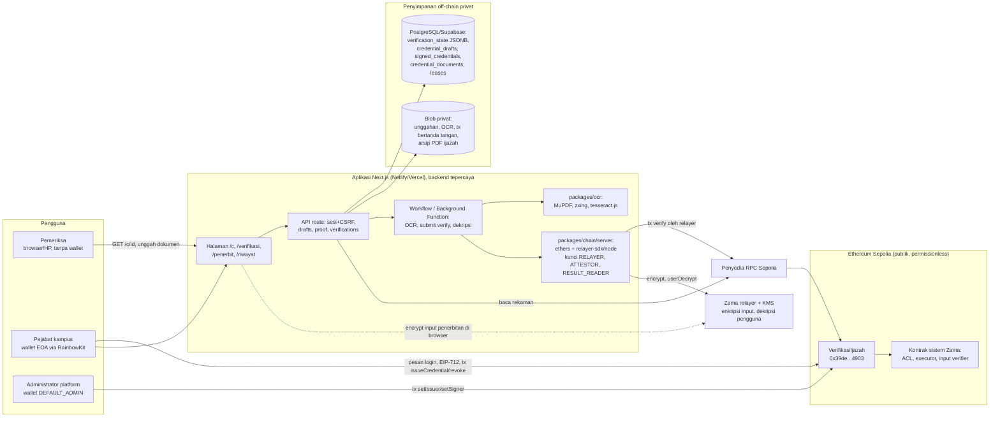

# Laporan Kekurangan Aplikasi terhadap Pedoman UAS Blockchain

Laporan pemeriksaan kepatuhan aplikasi **Verifikasi Ijazah** (Ethereum Sepolia dan Zama FHEVM) terhadap pedoman *Soal Ujian Akhir Semester (UAS) Blockchain TA 2026/2027 Ganjil*, Program Studi Informatika, Universitas Siliwangi.

Laporan ini disusun sebagai masukan bagi asisten berikutnya yang akan menulis instruksi implementasi untuk AI agent. Isinya hanya hasil pemeriksaan dan rekomendasi; tidak ada kode, kontrak, konfigurasi, database, atau deployment yang diubah selama pemeriksaan.

---

## 0. Identitas pemeriksaan dan cara membaca

### 0.1 Identitas

| Butir | Keterangan |
| --- | --- |
| Tanggal pemeriksaan | 4 Oktober 2026 (WIB) |
| Repositori | Monorepo pnpm `verifikasi-monorepo`, branch `main` |
| Commit yang diperiksa | `efa663b690ac12a2cbe8b1dffa29b5a9cdf22add` ("fix(documents): generate issuer PDFs without OCR gate", 27 September 2026) |
| Sumber persyaratan | `docs/Soal UAS/Soal_UAS_Blockchain_TA_2026_2027_Ganjil.pdf`, 6 halaman. Teks diekstrak dengan `pdftotext -layout`, lalu halaman 1 dan 5 (kop dan tabel rubrik) diperiksa visual karena ekstraksi teks mengacak tabel |
| Lingkungan uji lokal | Windows 11, Node.js v24.21.0, pnpm 10.19.0. Environment shell tidak memuat variabel rahasia. Berkas `.env` dan `.env.local` ada di root tetapi **tidak dibaca** |
| Salinan bersih | `git archive HEAD` ke folder sementara, `pnpm install --frozen-lockfile --offline`, `.env` dibuat dari `.env.example` (mode demo, tanpa database, RPC, atau kunci). Salinan ini sudah dihapus setelah pemeriksaan |
| Pemeriksaan jaringan | Hanya baca: `eth_*` ke RPC publik Sepolia (publicnode dan thirdweb). Tidak ada transaksi, tidak ada kunci yang dimuat |
| Keamanan dependensi | Lockfile dan `node_modules` dicocokkan dengan denylist paket berbahaya milik pengguna. **Tidak ada versi terlarang.** Versi terdekat yang terpasang aman: `keyv@5.6.0`, `cacheable@2.5.0`, `@cacheable/utils@2.5.0`, `@cacheable/memory@2.2.0`, `cacheable-request@13.0.19`, `file-entry-cache@11.1.5`, `flat-cache@6.1.23` |

### 0.2 Legenda

**Tingkat bukti** yang dipakai di seluruh laporan:

| Kode | Arti |
| --- | --- |
| `[KODE]` | Disimpulkan dari pembacaan kode aktual pada commit di atas |
| `[UJI-MOCK]` | Diuji otomatis, tetapi chain, FHE, RPC, wallet, atau penyimpanan diganti mock/fixture |
| `[UJI-NYATA-LOKAL]` | Diuji dengan komponen nyata di mesin lokal (misalnya OCR tesseract.js sungguhan), tanpa testnet |
| `[SEPOLIA]` | Terbukti dari data on-chain Sepolia (transaksi, event, atau state) |
| `[DOK]` | Hanya disebut di dokumentasi; belum dicocokkan dengan kode atau uji |
| `[BELUM-DIUJI]` | Implementasi ada, tetapi tidak ditemukan bukti eksekusi |

**Status pemenuhan:** Memenuhi, Memenuhi sebagian, Belum tersedia, Belum dapat dibuktikan, Berlaku bersyarat.

**Jenis pekerjaan:** Fitur aplikasi, Perbaikan kontrak, Perbaikan backend/frontend, Integrasi, Pengujian, Deployment, Audit, Dokumentasi.

**Prioritas:** P0 (wajib sebelum demo UAS; menyangkut butir PDF atau temuan terbukti), P1 (penting untuk nilai dan kualitas bukti), P2 (perbaikan pendukung), Opsional (di luar kewajiban PDF).

---

## 1. Jawaban langsung

**Kesiapan aplikasi.** Aplikasi sudah memenuhi inti kebutuhan fungsional Project 1 dan Project 2. Kontrak `VerifikasiIjazah.sol` dapat dikompilasi, memakai fitur Solidity yang relevan, dan sudah ter-deploy di Sepolia `[SEPOLIA]`. Frontend terhubung ke wallet melalui RainbowKit/wagmi, dan alur penerbitan sudah menghasilkan 7 event `CredentialIssued` serta 4 event `ComparisonRequested` (transaksi pencocokan FHE) di Sepolia. Halaman QR publik pada situs Netlify mengembalikan `VERIFIED_RECORD` untuk kredensial uji `[SEPOLIA]`. Sebanyak 353 tes unit dan kontrak lulus pada commit ini.

**Kekurangan aplikasi yang wajib dikerjakan** (bukan sekadar dokumen):

1. **Remediasi audit belum ada sama sekali.** Kontrak hanya memiliki satu commit (`a8e594e`, 24 September 2026), sehingga tidak ada versi sebelum/sesudah perbaikan maupun tes verifikasi perbaikan. Project 3 berbobot 25 poin, tertinggi di rubrik. Laporan ini menemukan beberapa temuan valid yang dapat diperbaiki dengan perubahan kode dan tes (bagian 6).
2. **Pemisahan peran tidak berlaku pada deployment nyata.** Keempat peran kontrak (`DEFAULT_ADMIN_ROLE`, `ATTESTOR_ROLE`, `RELAYER_ROLE`, `RESULT_READER_ROLE`) dan satu-satunya wallet penandatangan institusi dipegang **satu alamat yang sama** (`0xCa01…4096`) `[SEPOLIA]`. Karena transaksi `verify` dikirim alamat itu, kunci privatnya juga dipakai backend sebagai kunci layanan. Belum ada skrip atau UI untuk merotasi peran.
3. **Integrasi testnet belum dibuktikan untuk pencabutan dan hasil FHE.** Belum ada satu pun event `CredentialRevoked` di Sepolia, dan hasil dekripsi keempat transaksi `verify` (cocok atau tidak) tidak terdokumentasi.
4. **Tes E2E usang membuat `pnpm test:e2e` gagal.** Commit terakhir mengubah label dan fase PDF penerbit, tetapi `wallet.spec.ts` tidak ikut diperbarui. Hasilnya 3 dari 22 tes gagal, dan CI (yang menjalankan `pnpm test:e2e`) hampir pasti merah.
5. **Tes kontrak belum mencakup kasus batas, dan coverage belum diukur.** Sub-CPMK-8 menyebut *test coverage*.

**Tech stack dapat dipertahankan.** Seluruh perbaikan dapat dikerjakan dengan Solidity 0.8.28, Hardhat 2.28.6, `@fhevm/solidity` 0.11.1, dan relayer SDK 0.4.1 yang sudah terbukti bekerja bersama di Sepolia. Kebutuhan tambahan hanya berupa dev-dependency opsional untuk coverage atau verifikasi explorer, yang wajib dicek terhadap denylist sebelum dipasang. Tidak perlu migrasi ke Hyperledger Fabric; Project 4 hanya meminta perbandingan.

**Kelengkapan paket UAS** jauh lebih rendah daripada kesiapan aplikasinya. Belum ada `Security_Audit`, `Deployment_Record`, diagram arsitektur, evaluasi enterprise/nonfungsional, laporan UAS, slide, video demo, maupun riwayat kontribusi anggota kelompok (seluruh 35 commit dari satu penulis). Kekurangan ini dirinci terpisah di bagian 8 dan tidak dihitung sebagai fitur aplikasi.

---

## 2. Kondisi aplikasi sekarang

### 2.1 Fitur yang tersedia

| Halaman / fitur | Fungsi | Tingkat bukti |
| --- | --- | --- |
| `/c/{credentialId}` (halaman QR publik) | Memverifikasi signature EIP-712, hash profil publik, ikatan on-chain, kewenangan signer historis, konfirmasi, dan status pencabutan, tanpa login, wallet, atau unggahan. Cakupan `RECORD_ONLY`, `documentDecision: null` | `[SEPOLIA]` (situs Netlify mengembalikan `VERIFIED_RECORD`, 28 Sep), `[UJI-MOCK]` (5 tes E2E `record.spec.ts` lulus) |
| `/penerbit`, tab **Portal Kredensial Institusi** | Admin memanggil `setIssuer` dan `setSigner` lewat wallet | `[SEPOLIA]` (1 `IssuerUpdated`, 1 `SignerUpdated`), UI `[UJI-MOCK]` |
| `/penerbit`, tab **Portal Penerbitan Ijazah Mahasiswa** | Lima tahap: isi data, tinjau profil publik, sahkan EIP-712, kirim `issueCredential`, unduh PDF. Atribut dienkripsi di browser dengan relayer SDK Zama | `[SEPOLIA]` (7 penerbitan), `[UJI-MOCK]` |
| `/penerbit`, tab **Data Ijazah Mahasiswa** | Daftar kredensial institusi, PDF ijazah privat, pencabutan `revoke` | Daftar dan PDF `[UJI-MOCK]`; pencabutan `[BELUM-DIUJI]` di Sepolia (0 event `CredentialRevoked`) |
| `/verifikasi` | Unggah PDF/JPG/PNG (maks. 10 MiB, 5 halaman), OCR in-process (MuPDF.js, zxing-wasm, tesseract.js `ind+eng`), lalu pencocokan empat atribut melalui transaksi `verify` FHE, dekripsi oleh result reader, dan keputusan `MATCH`/`MISMATCH`/`INCONCLUSIVE`/dst. Cakupan `CHECKED_ATTRIBUTES` | OCR `[UJI-NYATA-LOKAL]`; transaksi `verify` `[SEPOLIA]` (4 transaksi sukses); hasil dekripsi `[BELUM-DIUJI]` (tidak terdokumentasi) |
| `/riwayat` | Riwayat pekerjaan milik sesi, laporan PDF, penghapusan artefak | `[UJI-MOCK]` |
| `/panduan` | Panduan dan pencarian lokal (sinonim, toleransi salah ketik) | `[UJI-MOCK]` (E2E `search.spec.ts` lulus) |
| Laporan PDF hasil unggahan | Request ID, digest, commitment, hasil per field, tx penerbitan dan tx pencocokan dipisahkan | `[UJI-MOCK]` |
| Retensi | Artefak unggahan kedaluwarsa 1 jam setelah terminal (maks. 24 jam), tombstone sebelum hapus | `[UJI-MOCK]` |

Cakupan kredensial yang benar-benar didukung adalah ijazah dengan empat atribut (`full_name`, `diploma_number`, `study_program`, `graduation_date`). Parser OCR hanya mengenali template sintetis A1 dan B1 serta template PDF terbitan aplikasi D1. Tata letak lain berakhir `INCONCLUSIVE`.

### 2.2 Stack dan versi aktual

| Lapisan | Teknologi dan versi (dari manifest/lockfile) |
| --- | --- |
| Runtime | Node.js `>=22.12.0` (diuji v24.21.0), pnpm 10.19.0, TypeScript 5.9.3 |
| Web dan API | Next.js 16.3.6 (build `--webpack`), React 19.3.0, Tailwind CSS 4.3.3 |
| Wallet | RainbowKit 2.2.11, wagmi 2.19.5, viem 2.56.8, ethers 6.16.0 (BrowserProvider untuk transaksi) |
| Kontrak | Solidity 0.8.28 (solc-js lokal, optimizer 200 runs, `viaIR`, EVM `cancun`), Hardhat 2.28.6, `@openzeppelin/contracts` 5.6.1, `@fhevm/solidity` 0.11.1, `encrypted-types` 0.0.4 |
| Uji kontrak | `@fhevm/hardhat-plugin` 0.4.2 dan `@fhevm/mock-utils` 0.4.2 (FHEVM mock), mocha bawaan Hardhat |
| FHE | `@zama-fhe/relayer-sdk` 0.4.1 (`/web` di browser untuk penerbitan, `/node` di server untuk pencocokan dan dekripsi), `SepoliaConfig` tanpa API key |
| OCR | tesseract.js 7.0.0, `@tesseract.js-data/ind` dan `eng` 1.0.0 (tessdata 4.0.0), mupdf 1.28.1, zxing-wasm 3.1.4 |
| Database | PostgreSQL (Supabase) melalui drizzle-orm 0.45.3, drizzle-kit 0.31.11, `pg`; tiga migrasi (`0000` sampai `0002`) |
| Penyimpanan | Netlify Blobs (hosting aktual), Vercel Blob privat, S3 privat, disk lokal (demo) |
| Eksekusi latar | Workflow SDK `workflow` 4.8.9 (lokal/Vercel), Netlify Background Functions (hosting aktual) |
| PDF | pdf-lib dan `@pdf-lib/fontkit`, Noto Sans tertanam |
| Uji aplikasi | Vitest 3.2.7 (paket chain memakai 3.2.4), Playwright `^1.63.0` |
| CI | GitHub Actions `.github/workflows/ci.yml`: install, lint, typecheck, test, `test:db` (service PostgreSQL), build, E2E |

Catatan hosting: `CLAUDE.md` dan PRD menetapkan Vercel sebagai target, tetapi situs yang berjalan adalah Netlify (`sage-daifuku-cef5a6.netlify.app`) dengan `netlify.toml` dan runner khusus Netlify. Kedua jalur ada di kode. Pemilik proyek perlu memutuskan hosting resmi untuk demo UAS dan menyelaraskan dokumen.

### 2.3 Arsitektur dan integrasi antarbagian

Diagram berikut menggambarkan implementasi **saat ini** dan dapat dijadikan dasar `Architecture_Diagram` (butir G.7). Subgraph menandai batas kepercayaan.

| Hubungan | Implementasi | Bukti |
| --- | --- | --- |
| Browser ke API | Cookie sesi HttpOnly, SameSite Strict, Secure di HTTPS; setiap mutasi memeriksa `Origin` dan header `x-csrf-token` (`apps/web/src/server/http.ts:22-47`) | `[UJI-MOCK]` `session-api.test.ts`, `portal-session.test.ts` |
| Autentikasi portal | Challenge sekali pakai (5 menit) ditandatangani `personal_sign`, diverifikasi `verifyMessage`, lalu kewenangan dibaca dari kontrak (`apps/web/src/app/api/portal/session/route.ts`, `challenge/route.ts`) | `[UJI-MOCK]` 7 tes E2E wallet lulus (wallet fixture EIP-6963) |
| Wallet ke kontrak | `packages/chain/src/browser.ts`: `prepareCredential` (enkripsi sekali), `signPreparedCredential` (EIP-712), `submitCredential` (`issueCredential`, menunggu minimal 2 konfirmasi, menerima speed-up yang calldata-nya identik), `revokeCredential`, `setIssuer`, `setSigner` | `[SEPOLIA]` penerbitan; pencabutan `[BELUM-DIUJI]` |
| Backend ke kontrak (baca) | `packages/chain/src/shared.ts:79-129` `readCredential`: membaca pada blok `head - (konfirmasi - 1)`, memeriksa versi, event `CredentialIssued` di blok penerbitan, dan kewenangan signer historis | `[UJI-MOCK]` `credential-read.test.ts`; `[SEPOLIA]` situs Netlify |
| Backend ke kontrak (tulis) | `packages/chain/src/server.ts:96-153` `submitComparison`: enkripsi digest atribut, attestation EIP-712 oleh attestor, tx `verify` oleh relayer, outbox tx bertanda tangan disimpan sebelum broadcast | `[SEPOLIA]` 4 tx `verify` sukses; `[UJI-MOCK]` `recovery.test.ts` |
| Dekripsi hasil | `server.ts:156-197` `readComparison`: `userDecrypt` oleh result reader, lalu status rekaman dibaca ulang setelah dekripsi | `[UJI-MOCK]`; hasil nyata `[BELUM-DIUJI]` |
| Database | Satu baris JSONB `verification_state` dikunci `FOR UPDATE` untuk sesi, kuota, pekerjaan, dan audit (`apps/web/src/server/db/state.ts:6-16`); tabel terpisah untuk draft, signed credential, dokumen, dan lease relayer; RLS aktif | `[BELUM-DIUJI]` di pemeriksaan ini (`pnpm test:db` butuh PostgreSQL lokal) |
| Penyimpanan | `apps/web/src/server/storage.ts`, `netlify-storage.ts`: path ditentukan server, ukuran/MIME/signature/SHA-256 diperiksa ulang | `[UJI-MOCK]` `uploads.test.ts`, `netlify-blobs.test.ts` |
| OCR | `packages/ocr`: render 200 DPI, QR di-mask sebelum OCR, ambang confidence 0,90, batas 5 halaman dan 20 juta piksel, timeout 210 detik | `[UJI-NYATA-LOKAL]` 45 tes OCR; E2E unggahan nyata berakhir aman tanpa testnet |

### 2.4 Inventaris smart contract

`contracts/src/VerifikasiIjazah.sol` (275 baris) mewarisi `ZamaEthereumConfig`, `AccessControl`, dan `EIP712`, serta memakai library `FHE` dan `ECDSA`.

| Unsur | Isi |
| --- | --- |
| Peran | `DEFAULT_ADMIN_ROLE` (registry institusi/signer, kelola peran), `ATTESTOR_ROLE` (menandatangani attestation hasil OCR), `RELAYER_ROLE` (mengirim `verify`), `RESULT_READER_ROLE` (berhak mendekripsi hasil). Penandatangan institusi bukan role AccessControl, melainkan registry `signerAuthorizations` |
| State | `issuers` (mapping `bytes32` ke struct `Issuer`), `signerAuthorizations` dan `signerAuthorizationIds` (riwayat kewenangan per periode), `credentials` (private, struct `Credential` dengan `euint256[4] attributes`), `issuerCredentials` (array per institusi), `comparisons` (struct `Comparison` dengan `ebool[4] fields` dan `ebool allMatch`), `requestUsed`, `nonceUsed`, `issuanceNonceUsed` |
| Fungsi tulis | `setIssuer` (admin), `setSigner` (admin), `issueCredential` (signer aktif institusi aktif, wajib signature EIP-712 payload), `revoke` (signer aktif institusi yang sama, permanen), `verify` (relayer, wajib attestation attestor) |
| Fungsi baca | `getSigner`, `getCredential`, `getIssuerCredentials` (berhalaman, maks. 100), `getComparison`, `hashCredentialAuthorization`, konstanta versi |
| Event | `IssuerUpdated`, `SignerUpdated`, `CredentialIssued`, `CredentialRevoked`, `ComparisonRequested`, ditambah `RoleGranted`/`RoleRevoked` dari OpenZeppelin |
| Custom error | `UnauthorizedIssuer`, `InvalidCredential`, `CredentialAlreadyExists`, `CredentialInactive`, `InvalidAttestation`, `ExpiredAttestation`, `ReplayedRequest`, `ReplayedNonce`, `InvalidVersion`, `InvalidAddress`, `InvalidCredentialAuthorization`, `ExpiredCredentialAuthorization` |
| Aturan bisnis utama | Penerbitan wajib signature payload dari `msg.sender` yang sama, nonce sekali pakai per signer, deadline pengajuan, ID unik, versi 1, `publicDataHash` bukan nol, hash handle terenkripsi terikat. Pencocokan wajib attestation terikat domain, request ID dan nonce sekali pakai, versi skema/encoding/normalizer, hash handle, relayer pemanggil, result reader berperan, kredensial aktif, dan institusi aktif |
| Privasi | Tidak ada plaintext atribut atau digest plaintext di calldata/event/storage. Referensi disimpan sebagai `euint256`. ACL: kontrak dan signer penerbit untuk referensi; result reader untuk hasil. Tidak ada `makePubliclyDecryptable` |

State transition kredensial: **Tidak ada**, lalu `issueCredential` menjadi **Aktif**, lalu `revoke` menjadi **Dicabut** (permanen). Status institusi (`active`) dan kewenangan signer berubah terpisah dan tidak menghapus validitas historis kredensial.

Fitur Solidity yang dipakai: function dan visibility (external/public/private/view/pure), mapping, array, struct, modifier `onlyRole` (warisan), event, inheritance (3 kontrak induk), library (`FHE`, `ECDSA`), custom error, dan access control. Yang tidak dipakai: `enum`, modifier buatan sendiri, dan `interface` buatan sendiri. PDF memakai kata "sesuai kebutuhan proyek", jadi ketiadaan ini **bukan kekurangan wajib** (lihat OP-01).

### 2.5 Deployment Sepolia yang terbukti

Data berikut berasal dari pemeriksaan read-only 28 September 2026 (`docs/bahan-laporan-UTS/BUKTI_UTS_BAGIAN_B/06-bukti-sepolia-readonly.txt`, berkas **tidak terlacak Git**) dan dicek ulang pada 4 Oktober 2026 pukul 02.01 WIB melalui RPC thirdweb.

| Butir | Nilai |
| --- | --- |
| Jaringan | Ethereum Sepolia, chain ID `11155111` |
| Alamat kontrak | `0x39de125002edA28c886d9125AE5d61BB5BE04903` (bytecode runtime 11.628 byte) |
| Tx deployment | `0xf94424d537ff0cd5fd1fd0a513f6fc9d3dc27ab537714d2cd72a15988784449a`, blok 11774130, 24 Sep 2026 19:29:24 UTC, gas 2.774.396 |
| Tx `setIssuer` | `0xaf40c6c11ce66cdc86ab80586ee7fc721a8dbad393191e3a14e13ab0be64117d`, gas 175.529 (institusi "UNSIL") |
| Tx `setSigner` | `0x71497e4b6b8d5ecbf7456301ce4752959b21324da6c0dc0b25e68cbf670e37a9`, gas 210.660 |
| Tx penerbitan uji pertama | `0xdc99421abd45eb84fe642762b1f9a6a219a82eec92baaf2ab3b351db921e4111`, blok 11774177, gas 1.003.341 (via MetaMask DelegationManager / EIP-7702) |
| Gas `issueCredential` | 895.707 sampai 895.743 (langsung ke kontrak), 986.193 sampai 1.003.341 (via DelegationManager) |
| Gas `verify` (FHE) | 1.002.536 sampai 1.002.572 (4 transaksi) |
| Jumlah event sejak deploy (dicek 4 Okt) | `RoleGranted` 4, `IssuerUpdated` 1, `SignerUpdated` 1, `CredentialIssued` 7, `ComparisonRequested` 4, `CredentialRevoked` **0**. Event terakhir di blok 11788195 (26 Sep 2026) |
| Pemegang peran (dicek 4 Okt) | `hasRole` bernilai `true` untuk **keempat** peran pada `0xCa01…4096`, alamat yang juga pembuat kontrak dan satu-satunya signer institusi |
| Verifikasi kode di explorer | Belum (`is_verified=false` di Blockscout). Bytecode on-chain identik dengan build lokal **kecuali 53 byte metadata CBOR**, sehingga verifikasi "full match" kemungkinan gagal dengan sumber saat ini |
| Situs | `https://sage-daifuku-cef5a6.netlify.app/c/0x94041102751df8441d5b53790c9c3d0866fd00219b8ad7fdda64faf774608e1f` mengembalikan HTTP 200 dan `VERIFIED_RECORD` (28 Sep). Versi commit yang berjalan di Netlify tidak diketahui |

Dokumentasi repositori bertentangan dengan fakta ini: `docs/testnet.md:3` dan `docs/acceptance.md:3` masih menyatakan belum ada transaksi Sepolia.

### 2.6 Alur yang terbukti berjalan

| Alur | Implementasi | Uji mock | Uji nyata | Status end-to-end |
| --- | --- | --- | --- | --- |
| Registrasi institusi dan signer | Ada | Kontrak (mock) | `[SEPOLIA]` 1 + 1 transaksi | Terbukti |
| Penerbitan dengan e-sign EIP-712 + FHE input | Ada | Kontrak, chain, API | `[SEPOLIA]` 7 penerbitan | Terbukti |
| Verifikasi QR (`RECORD_ONLY`) | Ada | E2E, API | `[SEPOLIA]` via Netlify | Terbukti |
| Pembuatan PDF ijazah penerbit | Ada (tanpa OCR sejak `efa663b`) | Unit `documents.test.ts` lulus; E2E gagal (tes usang) | Tidak terdokumentasi untuk versi ini | Belum dapat dibuktikan |
| Unggah dokumen, OCR, dan keputusan | Ada | Unit, E2E (demo, berakhir aman tanpa chain) | OCR `[UJI-NYATA-LOKAL]` | Sebagian |
| Pencocokan FHE (`verify`) | Ada | Kontrak mock | `[SEPOLIA]` 4 tx sukses | Transaksi terbukti, hasil tidak terdokumentasi |
| Dekripsi hasil dan `MATCH`/`MISMATCH` | Ada | Pipeline mock | Tidak ada catatan | Belum dapat dibuktikan |
| Pencabutan dan efeknya di kedua jalur | Ada | Kontrak, pipeline, E2E (mock) | 0 event | Belum dapat dibuktikan |
| Rotasi wallet signer | Ada | Kontrak mock | Tidak ada | Belum dapat dibuktikan |
| Rotasi peran layanan/admin | Hanya fungsi OpenZeppelin `grantRole`/`revokeRole`; tanpa skrip atau UI | Tidak ada | Tidak ada | Belum tersedia |

### 2.7 Hasil pemeriksaan yang dijalankan pada 4 Oktober 2026

| No | Perintah | Lingkungan | Exit | Hasil |
| --- | --- | --- | --- | --- |
| 1 | `pnpm lint` | Direktori kerja | 1 | `check:structure` menolak 5 berkas Python **tidak terlacak** di `output/laporan/qa/` (`build_report.py`, `check_report.py`, `make_diagrams.py`, `render_pages.py`, `revise_report.py`). Bukan masalah repositori |
| 2 | `pnpm exec eslint apps/web/src packages/domain/src packages/chain/src packages/credentials/src packages/ocr/src` | Direktori kerja | 0 | Bersih |
| 3 | `pnpm lint` | Salinan bersih | 0 | "Struktur monorepo valid: 7 workspace" dan ESLint bersih |
| 4 | `pnpm typecheck` | Direktori kerja | 0 | Kontrak (build+ABI), domain, credentials, ocr, chain, web |
| 5 | `pnpm test` | Direktori kerja | 0 | **353 lulus**: kontrak 12 (FHEVM mock), domain 52, credentials 11, OCR 45, chain 55, web 178 |
| 6 | `hardhat compile --force` | Direktori kerja (`contracts/`) | 0 | "Compiled 24 Solidity files successfully (evm target: cancun)", tanpa peringatan |
| 7 | `pnpm build` | Salinan bersih | 0 | Build Next.js dan `check-deployment.mjs` lulus; trace memuat Zama SDK, WASM TFHE/TKMS, PostgreSQL, OCR `ind+eng` (161 MiB) |
| 8 | `CI=1 pnpm test:e2e` | Salinan bersih, mode demo | 1 | **19 lulus, 3 gagal**. Ketiga kegagalan: `wallet.spec.ts:13` (1280/800/390 px), timeout menunggu `getByLabel('Tanggal lulus', { exact: true })` di baris 70 |
| 9 | `pnpm test:db` | Tidak dijalankan | - | **Belum diuji**: tidak ada PostgreSQL lokal (`psql` tidak ada, daemon Docker Desktop tidak aktif). Tes sengaja menolak host non-localhost |
| 10 | `gh run list` | - | - | **Belum dapat dibuktikan**: GitHub CLI belum login, status CI tidak terbaca |
| 11 | Pembacaan RPC Sepolia | Read-only | 0 | Lihat bagian 2.5 |

`git status` sebelum dan sesudah tes identik, jadi tes tidak mengubah berkas terlacak.

Daftar 12 tes kontrak yang lulus (seluruhnya FHEVM mock, bukan bukti testnet): penolakan pembaruan registry, penerbitan, dan pencabutan tanpa kewenangan; perbandingan 256 bit dan dekripsi hanya untuk result reader; deteksi perubahan tiap field termasuk bit tinggi; penolakan replay request ID dan nonce attestor; penolakan signer, domain, relayer, deadline, dan binding input yang salah; penonaktifan pencocokan untuk kredensial dicabut dan institusi nonaktif; signature payload tetap wajib walau transaksi ditandatangani wallet berwenang; penolakan manipulasi payload, signature lintas domain, dan penukaran urutan ciphertext; replay dan kedaluwarsa penerbitan tanpa mengakhiri rekaman yang sudah terbit; rollback nonce dan rekaman saat input proof gagal; bukti signer historis setelah rotasi; dan riwayat periode kewenangan serta penolakan pemindahan signer lintas institusi.

---

## 3. Matriks kepatuhan seluruh butir PDF

Kutipan diambil persis dari PDF. Nomor halaman merujuk halaman PDF.

### 3.1 Identitas, skenario, dan permasalahan utama

| Butir dan halaman | Kutipan persis | Kondisi aktual dan bukti | Status | Tindak lanjut | Jenis |
| --- | --- | --- | --- | --- | --- |
| Pelaksanaan, hal. 1 | "Kelompok sesuai pembagian dosen; setiap anggota wajib memahami keseluruhan sistem" | 35 commit, satu penulis (`Maul`). Komposisi kelompok tidak tercatat di repositori | Belum dapat dibuktikan | Konfirmasi anggota kelompok; kontribusi nyata tiap anggota harus tercatat di commit atau dokumen | Dokumentasi |
| Produk Akhir, hal. 1 | "Prototipe DApp + Smart Contract + Unit Test + Audit Keamanan + Dokumentasi + Presentasi/Demo" | DApp, kontrak, dan unit test ada; audit, dokumentasi UAS, dan presentasi belum | Memenuhi sebagian | Bagian 4, 6, 8 | Campuran |
| A, hal. 1 | "Gunakan use case/proposal yang telah disetujui pada tahap sebelum UTS atau use case pengganti yang ditetapkan dosen." | Use case verifikasi ijazah (PRD v1.2, bahan UTS Bagian B). Bukti persetujuan dosen tidak ada di repositori | Belum dapat dibuktikan | Konfirmasi pemilik | Dokumentasi |
| A, hal. 1 | "Solusi harus dijalankan pada local blockchain atau test network" | Kode menolak chain selain 11155111 (`packages/chain/src/shared.ts:12`, `browser.ts:22`, `wallet-authentication.ts`). Deployment di Sepolia `[SEPOLIA]` | Memenuhi | - | - |
| A, hal. 1 | "dilarang menggunakan aset kripto nyata, private key utama, atau jaringan produksi untuk tugas ujian." | Sepolia, tanpa aset nyata. Satu alamat `0xCa01…4096` memegang semua peran sekaligus menjadi signer, dan wallet ini adalah akun MetaMask dengan delegasi EIP-7702. Apakah alamat ini "private key utama" pemilik tidak dapat dipastikan | Berlaku bersyarat | Pemilik mengonfirmasi bahwa `0xCa01…4096` akun uji khusus. Bila bukan, rotasi ke akun uji (FT-01, IN-01) | Deployment |
| Permasalahan Utama, hal. 1 | "Apakah solusi blockchain yang dibangun benar-benar layak, aman, teruji, dapat direproduksi, serta memiliki arsitektur dan tata kelola yang dapat dipertanggungjawabkan?" | Layak dan teruji secara lokal; keamanan deployment dan tata kelola peran lemah (S-01, S-02); reproduksi deployment belum terdokumentasi | Memenuhi sebagian | Bagian 4 sampai 10 | - |

### 3.2 Project 1: Desain solusi, smart contract, dan arsitektur DApp (hal. 2, bobot 20)

| Butir | Kutipan persis | Kondisi aktual dan bukti | Status | Tindak lanjut | Jenis |
| --- | --- | --- | --- | --- | --- |
| B.1 | "Tentukan aktor/stakeholder, aset/data utama, alur transaksi, dan kebutuhan trust yang menjadi dasar solusi." | Ada di PRD §4, §5, §10.2 dan `CLAUDE.md`; aktor tercermin di kode (peran kontrak, sesi anonim, wallet kampus) | Memenuhi sebagian | Ringkas menjadi dokumen desain UAS | Dokumentasi |
| B.2 | "Buat diagram arsitektur yang memperlihatkan frontend, wallet/provider, smart contract, jaringan blockchain, serta komponen off-chain bila digunakan." | Tidak ada diagram terlacak di repositori. Draf Mermaid tersedia di bagian 2.3 laporan ini | Belum tersedia | Buat diagram final (PNG/PDF) | Dokumentasi |
| B.3 | "Tentukan data yang disimpan on-chain dan off-chain beserta alasan teknisnya." | Implementasi konsisten: on-chain hanya hash, digest e-sign, handle ciphertext, status, blok; off-chain payload bertanda tangan, profil publik, tanggal PDF privat, pekerjaan, arsip. Alasan ada di PRD §8.3 dan §10.8 | Memenuhi (kode); dokumen UAS belum | Tabel on-chain/off-chain beserta alasannya | Dokumentasi |
| B.4 | "Rancang kontrol akses/role dan aturan bisnis utama pada smart contract." | Empat peran dan registry signer di kontrak; aturan bisnis lengkap (bagian 2.4). Deployment memusatkan semua peran pada satu alamat | Memenuhi sebagian | FT-01, IN-01, FX-01(d) | Perbaikan kontrak, Deployment |
| B.5 | "Implementasikan fitur Solidity yang relevan, seperti function, visibility, mapping/array/struct/enum, modifier, event, inheritance/interface/library, error handling, dan access control sesuai kebutuhan proyek." | Semua dipakai kecuali enum, modifier buatan sendiri, dan interface buatan sendiri | Memenuhi | Opsional: OP-01 | - |
| B.6 | "Jelaskan keputusan desain yang paling penting serta trade-off yang diambil." | Keputusan ada di PRD dan `docs/implementation.md` (EIP-712, `euint256`, tanpa proxy, backend OCR tepercaya, satu baris JSONB). Belum dirangkum untuk UAS | Memenuhi sebagian | Dokumen keputusan desain | Dokumentasi |
| Luaran B | "Diagram arsitektur dan alur transaksi." | Belum ada | Belum tersedia | Lihat B.2 | Dokumentasi |
| Luaran B | "Source code smart contract yang dapat dikompilasi." | `hardhat compile --force` lulus tanpa peringatan (4 Okt) | Memenuhi | - | - |
| Luaran B | "Dokumen desain singkat yang menjelaskan model data, kontrol akses, dan keputusan on-chain/off-chain." | PRD 623 baris ada, tetapi bukan dokumen desain singkat UAS | Memenuhi sebagian | Susun dokumen singkat | Dokumentasi |

### 3.3 Project 2: Testing, debugging, deployment, dan integrasi (hal. 2 sampai 3, bobot 20)

| Butir | Kutipan persis | Kondisi aktual dan bukti | Status | Tindak lanjut | Jenis |
| --- | --- | --- | --- | --- | --- |
| C.1 | "Siapkan unit test untuk skenario positif, negatif, batas, dan kontrol akses." | 12 tes kontrak (mock) mencakup positif, negatif, replay, dan kontrol akses. Kasus batas belum lengkap (daftar di T-02). 341 tes TypeScript lulus | Memenuhi sebagian | T-02, T-03 | Pengujian |
| C.2 | "Tunjukkan proses compile dan debugging untuk sekurang-kurangnya satu kasus kegagalan atau kondisi tidak valid." | Compile berhasil; tes memeriksa custom error. Tidak ada catatan sesi debugging kontrak. Satu episode debugging skrip integrasi tercatat di berkas bukti UTS yang tidak terlacak | Memenuhi sebagian | T-05 | Pengujian, Dokumentasi |
| C.3 | "Lakukan deployment ke local blockchain atau test network yang diizinkan dosen." | Ter-deploy di Sepolia `[SEPOLIA]` | Memenuhi (dengan asumsi Sepolia diizinkan) | Konfirmasi izin jaringan | Deployment |
| C.4 | "Catat contract address, network, transaction hash yang relevan, serta langkah reproduksi deployment." | Data hanya ada di berkas bukti UTS yang tidak terlacak. `contracts/scripts/deploy.cjs:13` hanya mencetak JSON ke konsol; tidak ada berkas deployment record; `docs/testnet.md` menyatakan belum ada transaksi | Memenuhi sebagian | D-01, FX-02 | Deployment, Dokumentasi |
| C.5 | "Integrasikan antarmuka/client dengan wallet/provider dan smart contract." | RainbowKit/wagmi untuk koneksi dan login; ethers `BrowserProvider` untuk tanda tangan dan transaksi; server `JsonRpcProvider` untuk baca dan relayer `[SEPOLIA]` | Memenuhi | - | - |
| C.6 | "Demonstrasikan sekurang-kurangnya satu event atau perubahan state yang dapat diverifikasi dari transaksi." | Event `CredentialIssued` dan state `getCredential` terverifikasi `[SEPOLIA]`; halaman QR menampilkan tx penerbitan, tetapi tanpa tautan explorer; tx pencabutan dan tx admin tidak ditampilkan | Memenuhi | Perkuat demo dengan FT-02 | Fitur aplikasi |
| Luaran C | "Folder unit test dan hasil pengujian." | Folder tes lengkap; hasil uji versi final tidak tersimpan di lokasi terlacak | Memenuhi sebagian | T-10 | Pengujian |
| Luaran C | "Deployment record dan bukti transaksi pada local/test network." | Lihat C.4 | Memenuhi sebagian | D-01 | Deployment |
| Luaran C | "Frontend/client sederhana atau script integrasi." | Frontend lengkap | Memenuhi | - | - |
| Luaran C | "README langkah instalasi dan reproduksi." | README ada (instalasi, tes, deploy). Belum memuat alamat kontrak, tx, URL demo; `README.md:38` usang (masih menyebut PDF diperiksa OCR/FHE) | Memenuhi sebagian | D-03 | Dokumentasi |
| OBE C, hal. 3 | "Mengukur Sub-CPMK-8: compile, unit testing, debugging, deployment, test coverage, test network, dan integrasi frontend dengan smart contract." | Coverage tidak diukur (tidak ada `solidity-coverage` atau `@vitest/coverage-*`) | Belum tersedia | T-04 | Pengujian |

### 3.4 Project 3: Security audit dan perbaikan (hal. 3, bobot 25)

| Butir | Kutipan persis | Kondisi aktual dan bukti | Status | Tindak lanjut | Jenis |
| --- | --- | --- | --- | --- | --- |
| D (pengantar) | "Lakukan audit keamanan terhadap smart contract kelompok sendiri dan, bila ditetapkan dosen, lakukan peer audit silang terhadap kontrak kelompok lain." | Tidak ada dokumen audit. Peer audit bergantung pada penetapan dosen | Belum tersedia; peer audit Berlaku bersyarat | Bagian 6 sebagai draf temuan | Audit |
| D.1 | "Susun threat model ringkas: aset yang dilindungi, aktor, trust boundary, dan skenario penyalahgunaan." | Batas kepercayaan dibahas di `CLAUDE.md` dan PRD §10.2, tetapi belum dalam bentuk threat model | Belum tersedia | Draf di bagian 6.1 | Audit |
| D.2 | "Periksa minimal aspek reentrancy, access-control flaw, front-running/transaction-ordering risk, oracle risk, DoS, validasi input, serta error handling sesuai relevansi kontrak." | Analisis per aspek tersedia di bagian 6.2 laporan ini; belum ada audit resmi | Belum tersedia | Formalkan menjadi Security_Audit | Audit |
| D.3 | "Klasifikasikan setiap temuan berdasarkan dampak dan kemungkinan eksploitasi secara argumentatif." | Belum ada | Belum tersedia | Bagian 6.3 berisi klasifikasi awal | Audit |
| D.4 | "Perbaiki temuan yang valid dan jelaskan perubahan kode yang dilakukan." | Kontrak hanya satu commit (`a8e594e`); tidak ada perbaikan | Belum tersedia | FX-01, FT-01, FX-02, FX-03 | Perbaikan kontrak, Perbaikan backend |
| D.5 | "Tambahkan atau perbarui unit test untuk membuktikan bahwa perbaikan bekerja." | Tidak ada tes perbaikan | Belum tersedia | T-03 | Pengujian |
| D.6 | "Buat tabel audit yang menghubungkan temuan, bukti, risiko, mitigasi, dan status verifikasi." | Belum ada | Belum tersedia | Bagian 6.3 sebagai dasar | Audit |
| Luaran D | "Laporan audit keamanan." | Belum ada | Belum tersedia | Security_Audit | Audit |
| Luaran D | "Versi kode sebelum/sesudah perbaikan atau commit yang dapat ditelusuri." | Tidak ada | Belum tersedia | Tetapkan baseline (tag pada `efa663b`), lalu satu commit per temuan | Audit |
| Luaran D | "Unit test verifikasi perbaikan." | Tidak ada | Belum tersedia | T-03 | Pengujian |

### 3.5 Project 4: Enterprise blockchain, privasi, dan evaluasi nonfungsional (hal. 3 sampai 4, bobot 15)

| Butir | Kutipan persis | Kondisi aktual dan bukti | Status | Tindak lanjut | Jenis |
| --- | --- | --- | --- | --- | --- |
| E.1 | "Bandingkan solusi berbasis Ethereum/public blockchain dengan pendekatan Hyperledger Fabric atau permissioned blockchain pada aspek identitas, permissioning, konsensus, privasi data, throughput, governance, dan biaya operasional." | Belum ada. Tidak perlu implementasi kedua | Belum tersedia | Matriks perbandingan; data pendukung di bagian 8.4 | Dokumentasi |
| E.2 | "Evaluasi skalabilitas dan interoperabilitas solusi serta identifikasi bottleneck utama." | Belum ada evaluasi. Bottleneck dapat dibuktikan dari kode (S-12, satu lease relayer) dan gas Sepolia | Belum tersedia | T-08 lalu dokumen | Pengujian, Dokumentasi |
| E.3 | "Evaluasi privasi data dan jelaskan informasi mana yang tidak seharusnya diletakkan secara terbuka di blockchain." | Desain privasi sudah diterapkan (tidak ada plaintext atribut on-chain; tanggal lulus privat; FHE). Belum ada dokumen evaluasi UAS | Memenuhi (implementasi); dokumen Belum tersedia | Dokumen evaluasi; sertakan S-05 | Dokumentasi |
| E.4 | "Identifikasi isu tata kelola: siapa yang mengelola perubahan kontrak, node, role, upgrade, dan penyelesaian sengketa." | Kontrak tidak upgradeable (redeploy dan migrasi, bagian akhir `docs/testnet.md`). Satu admin tanpa jeda; node dikelola penyedia RPC; tidak ada tooling peran | Belum tersedia | Dokumen governance; FT-01 sebagai dukungan teknis | Dokumentasi, Fitur aplikasi |
| E.5 | "Simpulkan kondisi kapan public blockchain, permissioned blockchain, atau bahkan database tradisional lebih tepat digunakan untuk use case tersebut." | Belum ada | Belum tersedia | Dokumen | Dokumentasi |
| Luaran E | "Matriks perbandingan arsitektur." | Belum ada | Belum tersedia | Dokumen | Dokumentasi |
| Luaran E | "Evaluasi nonfungsional 2-3 halaman." | Belum ada | Belum tersedia | Dokumen | Dokumentasi |
| Luaran E, hal. 4 | "Rekomendasi arsitektur akhir beserta alasannya." | Belum ada | Belum tersedia | Dokumen | Dokumentasi |

### 3.6 Project 5: Final project showcase, dokumentasi, dan defense (hal. 4, bobot 20)

| Butir | Kutipan persis | Kondisi aktual dan bukti | Status | Tindak lanjut | Jenis |
| --- | --- | --- | --- | --- | --- |
| F.1 | "Sampaikan masalah, stakeholder, alasan penggunaan blockchain, dan kriteria keberhasilan proyek." | Materi ada di PRD; belum ada slide | Memenuhi sebagian | Slide | Dokumentasi |
| F.2 | "Demonstrasikan alur end-to-end: koneksi wallet/client, pemanggilan smart contract, transaksi, event/state change, dan verifikasi hasil." | Koneksi wallet, penerbitan, event, dan verifikasi QR terbukti. Pencabutan dan `MATCH`/`MISMATCH` FHE belum terbukti di testnet | Memenuhi sebagian | IN-02, IN-03, FT-02 | Integrasi |
| F.3 | "Tunjukkan hasil unit testing, deployment, security audit, perbaikan, dan keterbatasan yang masih ada." | Unit test dan deployment ada; audit dan perbaikan belum; E2E gagal 3 | Memenuhi sebagian | T-01, bagian 6 | Pengujian, Audit |
| F.4 | "Jelaskan aspek etika, regulasi, risiko, keberlanjutan, dan dampak jika solusi digunakan di dunia nyata." | Belum ada dokumen UAS. PRD membahas privasi, tetapi tidak membahas regulasi | Belum tersedia | Dokumen, misalnya terkait UU No. 27 Tahun 2022 tentang Pelindungan Data Pribadi | Dokumentasi |
| F.5 | "Setiap anggota wajib menjawab pertanyaan teknis dan menjelaskan kontribusinya berdasarkan riwayat commit/dokumentasi." | Semua commit dari satu penulis | Belum dapat dibuktikan | Konfirmasi kelompok; kontribusi tidak boleh dipalsukan | Dokumentasi |
| F.6 | "Sampaikan roadmap perbaikan yang realistis apabila proyek dilanjutkan." | Belum ada | Belum tersedia | Bagian 10 dan 4.4 dapat menjadi dasar | Dokumentasi |
| Luaran F | "Presentasi maksimal 10 slide." | Belum ada | Belum tersedia | - | Dokumentasi |
| Luaran F | "Demo langsung atau video demo cadangan." | Situs langsung ada; video belum | Memenuhi sebagian | Video setelah IN-02 dan IN-03 | Dokumentasi |
| Luaran F | "Laporan akhir proyek." | Belum ada | Belum tersedia | - | Dokumentasi |
| Luaran F | "Repositori final dengan README, diagram, source code, unit test, dan riwayat kontribusi." | README, kode, dan tes ada; diagram dan kontribusi belum | Memenuhi sebagian | D-03, G.7, G.10 | Dokumentasi |

### 3.7 Produk akhir UAS (hal. 4)

| Butir | Kutipan persis | Kondisi aktual | Status | Jenis |
| --- | --- | --- | --- | --- |
| G.1 | "README_Final.pdf atau README.md yang memuat deskripsi, dependensi, konfigurasi, dan langkah reproduksi." | `README.md` ada, sebagian usang, tanpa data deployment | Memenuhi sebagian | Dokumentasi |
| G.2 | "Laporan_UAS_Blockchain.pdf." | Tidak ada | Belum tersedia | Dokumentasi |
| G.3 | "Source code smart contract dan frontend/client." | Ada | Memenuhi | - |
| G.4 | "Folder test dan bukti hasil unit testing." | Folder ada; bukti versi final belum disimpan; E2E gagal 3 | Memenuhi sebagian | Pengujian |
| G.5 | "Deployment_Record.pdf atau file ekuivalen yang berisi network, contract address, transaction hash, dan bukti deployment." | Data ada di berkas bukti UTS tidak terlacak | Memenuhi sebagian | Deployment |
| G.6 | "Security_Audit.pdf dan bukti perbaikan." | Tidak ada | Belum tersedia | Audit |
| G.7 | "Architecture_Diagram.pdf/png." | Tidak ada | Belum tersedia | Dokumentasi |
| G.8 | "Slide_Presentasi.pdf atau .pptx." | Tidak ada | Belum tersedia | Dokumentasi |
| G.9 | "Video_Demo.mp4 atau tautan sesuai ketentuan dosen, sebagai cadangan apabila demo langsung bermasalah." | Tidak ada | Belum tersedia | Dokumentasi |
| G.10 | "Riwayat kontribusi/commit yang dapat ditelusuri." | 35 commit dari satu penulis | Belum dapat dibuktikan | Dokumentasi |

### 3.8 Rubrik dan matriks OBE (hal. 5 sampai 6)

Bobot rubrik (dicek visual): Desain Solusi dan Smart Contract 20%, Testing, Deployment dan Integrasi 20%, **Security Audit dan Remediation 25%**, Enterprise dan Evaluasi Nonfungsional 15%, Showcase, Dokumentasi dan Defense 20%. Rubrik kinerja skor 4 mensyaratkan "Solusi bekerja end-to-end; evidence dapat diverifikasi; pengujian dan audit memadai; desain konsisten; dokumentasi dapat direproduksi". Skor 1 antara lain: "temuan keamanan tidak ditangani". Butir H dan I bersifat penilaian, bukan kewajiban baru; keduanya dipakai untuk menentukan prioritas di bagian 10.

### 3.9 Ketentuan akademik dan keamanan (hal. 6)

| Butir | Kutipan persis | Kondisi aktual | Status | Tindak lanjut |
| --- | --- | --- | --- | --- |
| J.1 | "Seluruh demonstrasi wajib menggunakan local network atau test network yang diizinkan. Dilarang menggunakan private key utama, seed phrase pribadi, aset kripto nyata, atau jaringan produksi untuk ujian." | Sepolia. Status `0xCa01…4096` perlu konfirmasi | Berlaku bersyarat | Konfirmasi; rotasi bila perlu |
| J.2 | "Private key/seed phrase tidak boleh disimpan di repositori. Gunakan akun pengujian dan konfigurasi yang aman." | Tidak ada rahasia terlacak (`.gitignore` mengabaikan `.env*`; pemindaian `git grep` tidak menemukan nilai kunci). Konfigurasi peran tidak aman (S-01) | Memenuhi sebagian | FT-01, IN-01 |
| J.3 | "Setiap evidence harus dapat ditelusuri ke source code, commit, log pengujian, transaction hash, atau artefak teknis lain yang relevan." | Bukti Sepolia dan log uji UTS ada, tetapi tidak terlacak Git | Memenuhi sebagian | Simpan bukti final di folder terlacak (T-10, D-01) |
| J.4 | "Penilaian tidak didasarkan pada banyaknya screenshot, melainkan pada kualitas implementasi, pengujian, audit, argumentasi, dan reproduksibilitas." | Informatif | - | Utamakan log, tx hash, dan commit |
| J.5 | "Plagiarisme, penyalinan smart contract tanpa atribusi, pemalsuan kontribusi, dan manipulasi evidence tidak diperkenankan." | Kontrak mengimpor OpenZeppelin dan Zama melalui paket npm. Belum ada pernyataan atribusi pustaka/template di README | Memenuhi sebagian | Tambahkan bagian atribusi; jangan membuat commit atau kontribusi fiktif |
| J.6 | "Setiap anggota tim wajib memahami keseluruhan solusi dan dapat diminta menjelaskan bagian mana pun selama sesi defense." | Tidak dapat dinilai dari repositori | Belum dapat dibuktikan | Dokumentasi yang jelas membantu |
| J.7 | "Apabila demo langsung gagal karena kendala teknis, dosen dapat menilai berdasarkan video demo cadangan dan evidence yang dapat direproduksi." | Video belum ada | Belum tersedia | G.9 |

---

## 4. Daftar fitur dan implementasi yang perlu ditambahkan, diperbaiki, atau dituntaskan

Bagian ini hanya berisi pekerjaan **kode dan integrasi**. Pengujian dan dokumen ada di bagian 8.

**Tidak ada fitur produk baru berskala besar yang diwajibkan PDF.** Penerbitan, verifikasi QR, unggahan, OCR, FHE, pencabutan, dan portal sudah ada. Pekerjaan wajib yang tersisa adalah remediasi keamanan, tooling pengelolaan peran, penguatan jejak transaksi, dan pembuktian integrasi testnet.

### 4.1 Penambahan fitur baru

#### FT-01 Pengelolaan peran kontrak dan validasi pemisahan kunci layanan

| Aspek | Uraian |
| --- | --- |
| Kondisi sekarang | Kontrak mewarisi `grantRole`, `revokeRole`, dan `renounceRole` dari OpenZeppelin `AccessControl`, tetapi tidak ada skrip, UI, atau dokumentasi untuk memakainya. `deploy.cjs:4-8` hanya memeriksa format keempat alamat, tidak memeriksa apakah alamatnya berbeda. Backend tidak memeriksa apakah `RELAYER_PRIVATE_KEY`, `ATTESTOR_PRIVATE_KEY`, dan `RESULT_READER_PRIVATE_KEY` milik alamat yang berbeda |
| Masalah | Di Sepolia, keempat peran dan signer institusi dipegang `0xCa01…4096` (S-01). Karena tx `verify` dikirim alamat tersebut, kunci admin dan penerbit sekaligus tersimpan di environment hosting sebagai kunci layanan. Kebocoran satu kunci memberi kendali penuh |
| Dasar | PDF D.4 dan D.5 (perbaiki temuan valid dan buktikan dengan tes), E.4 ("siapa yang mengelola perubahan ... role"), J.1 dan J.2 (akun pengujian, konfigurasi aman); `CLAUDE.md` (kunci relayer, attestor, dan pembaca hasil hanya di backend dan terpisah dari wallet kampus) |
| Perubahan perilaku | (1) Skrip Hardhat `contracts/scripts/roles.cjs` dengan mode `show` (default, hanya baca: pemegang tiap peran beserta event `RoleGranted`/`RoleRevoked`), `grant`, `revoke`, dan `transfer-admin` (beri admin baru, verifikasi, baru `renounce` admin lama). Mode tulis wajib flag eksplisit `--execute` dan mencetak tx hash serta blok. (2) Validasi konfigurasi backend: turunkan alamat dari ketiga kunci layanan, tolak bila ada yang sama, dan tolak bila salah satunya memegang `DEFAULT_ADMIN_ROLE` atau merupakan signer institusi aktif. Kegagalan menjadi `ChainConfigurationError` yang jelas, bukan transaksi. (3) Opsional: tampilan baca pemegang peran pada tab Portal Kredensial Institusi untuk demo governance |
| Lokasi terdampak | Baru: `contracts/scripts/roles.cjs`. Ubah: `packages/chain/src/server.ts` (`secret()` baris 20-24, `submitComparison` baris 107-109), `packages/chain/src/shared.ts` (pemeriksaan konfigurasi), `apps/web/src/server/config.ts` (`requireRealConfiguration`), opsional `apps/web/src/features/portal/PortalPage.tsx` |
| Kriteria penerimaan | Di Sepolia, `hasRole` menunjukkan empat pemegang peran yang berbeda, tidak ada yang sama dengan signer institusi, dan `0xCa01…4096` tidak lagi memegang peran layanan. Tx `verify` baru berhasil dengan relayer baru. Backend menolak memproses pekerjaan bila kunci layanan duplikat |
| Pengujian | Hardhat (mock): setelah `revokeRole(RELAYER_ROLE, lama)`, panggilan `verify` oleh relayer lama gagal `AccessControlUnauthorizedAccount`; attestation yang ditandatangani attestor lama gagal `InvalidAttestation`; relayer, attestor, dan reader baru berhasil; `transfer-admin` tidak meninggalkan kontrak tanpa admin. Vitest: konfigurasi kunci duplikat ditolak sebelum SDK atau RPC dipanggil |
| Prioritas | P0 |
| Ketergantungan | Tidak bergantung pada redeploy; dapat dipakai pada kontrak yang ada. Bila FX-01 diikuti redeploy (IN-04), peran langsung dipisahkan saat deploy, dan skrip tetap diperlukan untuk rotasi berikutnya |

#### FT-02 Jejak transaksi yang dapat diverifikasi di UI (penerbitan, pencabutan, dan operasi admin)

| Aspek | Uraian |
| --- | --- |
| Kondisi sekarang | Halaman QR menampilkan tx penerbitan sebagai teks tanpa tautan explorer (`CredentialRecord.tsx:62`). `CredentialMetadata` hanya memuat `revocationBlock`, tanpa hash tx pencabutan (`packages/chain/src/types.ts:47`, `shared.ts:125`). `RecordVerificationResult` tidak punya field pencabutan (`packages/domain/src/schema.ts`). Portal membuang tx hash hasil `revokeCredential`, `setIssuer`, dan `setSigner` dan hanya menampilkan pesan teks (`PortalPage.tsx:103-105`) |
| Masalah | Saat demo, perubahan state pencabutan dan registry tidak dapat ditelusuri dari UI ke transaksi. PDF meminta tx hash yang relevan dan event atau perubahan state yang dapat diverifikasi |
| Dasar | PDF C.4, C.6, F.2 ("transaksi, event/state change, dan verifikasi hasil"); skenario A ("audit trail yang kuat") |
| Perubahan perilaku | (1) `readCredential` mencari event `CredentialRevoked(id)` pada `revokedBlock` (kueri satu blok, sama seperti penerbitan), lalu mengembalikan `revocationTransactionHash`. Bila pencarian log gagal, status **tetap** `REVOKED` (fail-closed) dan hash bernilai `null`. (2) Respons rekaman menambahkan `revokedAt`, `revocationBlock`, dan `revocationTxHash`. (3) Halaman QR menampilkan waktu, blok, dan tx pencabutan, serta tautan explorer yang dibentuk dari chain ID konfigurasi server (11155111 ke `https://sepolia.etherscan.io`), tidak pernah dari data QR. (4) Portal menampilkan tx hash dan tautan explorer setelah pencabutan dan perubahan registry |
| Lokasi terdampak | `packages/chain/src/shared.ts`, `packages/chain/src/types.ts`, `packages/domain/src/schema.ts`, `apps/web/src/server/credentials.ts` (`inspectCredential`), `apps/web/src/features/credentials/CredentialRecord.tsx`, `apps/web/src/features/portal/PortalPage.tsx`, helper tautan explorer baru di `apps/web/src/features/shared` |
| Kriteria penerimaan | Setelah pencabutan di Sepolia, `/c/{id}` menampilkan "Kredensial dicabut" beserta tx pencabutan yang mengarah ke Etherscan dan cocok dengan event `CredentialRevoked`. Status lain tidak berubah. `documentDecision` tetap `null` |
| Pengujian | `packages/chain/tests/credential-read.test.ts`: hash pencabutan terbaca; kegagalan log tetap `REVOKED`. E2E `record.spec.ts`: rekaman dicabut menampilkan tx dan tautan. Unit: pembentuk tautan hanya menerima chain ID yang dikonfigurasi |
| Prioritas | P1 |
| Ketergantungan | Sebaiknya selesai sebelum IN-02 agar pencabutan nyata langsung terdokumentasi di UI |

#### FT-03 Pengaman biaya relayer untuk transaksi pencocokan

| Aspek | Uraian |
| --- | --- |
| Kondisi sekarang | Setiap unggahan yang lolos OCR untuk rekaman `VERIFIED_RECORD` memicu satu tx `verify` yang dibayar relayer (sekitar 1,0 juta gas di Sepolia). Batas yang ada: 30 unggahan/sesi/jam dan 100/sumber/jam (`jobs.ts:79-80`), 20 pemeriksaan/credential/jam (`pipeline.ts:43`), dan 60 sesi baru/sumber/jam (`http.ts:36`). Tidak ada anggaran global dan tidak ada pemeriksaan saldo relayer |
| Masalah | Penyerang anonim dapat membuat PDF berformat template dengan QR publik dan atribut sembarang. Hasilnya `MISMATCH`, tetapi tetap memicu tx. Saldo test ETH relayer dapat habis, lalu seluruh pemeriksaan dokumen menjadi `ERROR` (S-08) |
| Dasar | PDF D.2 (DoS); PRD §12 (kuota sebagai mitigasi) |
| Perubahan perilaku | (1) Anggaran global tx pencocokan per jam (variabel lingkungan, misalnya `MAX_COMPARISONS_PER_HOUR`) dicek di `completeExtraction` sebelum `withRelayerLock`. Bila habis, pekerjaan berakhir dengan alasan jelas tanpa tx. (2) Sebelum menandatangani tx, saldo relayer dibandingkan dengan estimasi biaya; bila kurang, pekerjaan menjadi `FAILED` dengan kode `INSUFFICIENT_FUNDS` (sudah ada di allowlist `diagnostics.ts`) dan dapat di-retry tanpa menghabiskan nonce. (3) Tidak ada perubahan pada jalur QR |
| Lokasi terdampak | `apps/web/src/server/pipeline.ts` (sekitar baris 39-63), `packages/chain/src/server.ts` (`submitComparison`), `apps/web/src/server/config.ts`, `.env.example` |
| Kriteria penerimaan | Saat anggaran habis atau saldo kurang, tidak ada tx yang ditandatangani atau disiarkan, keputusan bukan `MATCH`, dan pesan menjelaskan penyebabnya |
| Pengujian | `apps/web/tests/unit/record-pipeline.test.ts` dan `packages/chain/tests/recovery.test.ts`: anggaran habis tanpa tx; saldo kurang tanpa tanda tangan; retry setelah saldo diisi memakai pekerjaan yang sama |
| Prioritas | P1 |
| Ketergantungan | FX-03 (kunci sumber permintaan yang benar) memperkuat efektivitasnya |

### 4.2 Perbaikan fitur dan kode yang sudah ada

#### FX-01 Remediasi kontrak hasil audit

Satu paket perubahan Solidity yang memerlukan **redeploy** (IN-04). Setiap sub-butir sebaiknya menjadi commit tersendiri agar sebelum/sesudah dapat ditelusuri.

| Sub | Perubahan | Lokasi | Temuan | Wajib/opsional |
| --- | --- | --- | --- | --- |
| a | Hapus `FHE.allow(referenceValue, msg.sender)`; pertahankan `FHE.allowThis`. Tidak ada kode aplikasi yang mendekripsi referensi (satu-satunya `userDecrypt` ada di `packages/chain/src/server.ts:181` untuk hasil) | `VerifikasiIjazah.sol:189` | S-05 | Wajib (least privilege, privasi) |
| b | Ganti `ECDSA.recover` dengan `ECDSA.tryRecover` dan petakan kegagalan ke `InvalidCredentialAuthorization` (penerbitan) serta `InvalidAttestation` (pencocokan) | `VerifikasiIjazah.sol:168`, `:235` | S-09 | Wajib (error handling) |
| c | Tambah error `InvalidIssuer` untuk `issuerId` nol, nama kosong atau lebih dari 200 byte, dan institusi belum terdaftar; pertahankan `InvalidAddress` hanya untuk alamat nol. Ubah no-op `setSigner(active=true)` untuk wallet yang sudah aktif menjadi revert `SignerAlreadyActive` | `:119`, `:126`, `:131` | S-10 | Wajib (validasi input, error handling) |
| d | Penegakan pemisahan peran on-chain: konstruktor menolak alamat admin, attestor, relayer, dan reader yang sama; override `_grantRole` menolak akun yang sudah memegang peran layanan lain atau admin; `setSigner` menolak wallet yang memegang peran layanan | `:110-116`, override baru, `:125` | S-01, S-02 | Disarankan (trade-off: kurang fleksibel). Minimal wajib di skrip deploy (FX-02) |
| e | Ikat `credentialId` ke institusi dan signer, misalnya wajib `credentialId == keccak256(abi.encode(block.chainid, address(this), issuerId, msg.sender, nonce))` | `:158-159`, `packages/chain/src/browser.ts` (`prepareCredential`), `PortalPage.tsx:72` | S-03 | Opsional (risiko rendah); bila tidak dikerjakan, catat sebagai risiko yang diterima beserta alasannya |
| f | Tambahkan `issuerNameHash` ke payload EIP-712 dan wajibkan sama dengan `keccak256(bytes(issuers[issuerId].name))` saat eksekusi | `:22-24`, `:183`, `packages/credentials/src/index.ts` | S-04 | Opsional; mengubah tipe EIP-712 dan memerlukan versi protokol baru |

| Aspek | Uraian |
| --- | --- |
| Kondisi sekarang | Kontrak satu commit, tanpa remediasi. Tes baris 90 justru menegaskan signer dapat mendekripsi referensi; tes baris 142-144 hanya memakai `assert.rejects` generik untuk signature rusak |
| Dasar | PDF D.4, D.5, Luaran D, G.6 |
| Perubahan perilaku | Sesuai tabel. ABI berubah (error baru), sehingga `contracts/generated/VerifikasiIjazah.json` dibangun ulang melalui `pnpm --filter @verifikasi/contracts build`, bukan disunting manual |
| Lokasi terdampak | `contracts/src/VerifikasiIjazah.sol`, `contracts/test/VerifikasiIjazah.cjs`, ABI hasil build, dan bila sub e/f dikerjakan: `packages/credentials`, `packages/chain/src/browser.ts`, `packages/chain/tests/*`, `apps/web/src/features/portal/PortalPage.tsx` |
| Kriteria penerimaan | Setiap temuan punya commit perbaikan dan tes yang gagal di baseline tetapi lulus setelah perbaikan; seluruh 353 tes lama tetap lulus (kecuali tes baris 90 yang memang diubah ekspektasinya); kompilasi tanpa peringatan |
| Pengujian | Lihat T-03 |
| Prioritas | P0 (sub a, b, c), P1 (sub d), Opsional (sub e, f) |
| Ketergantungan | Baseline dan draf audit dibuat lebih dulu (fase 0 di bagian 10); redeploy IN-04 setelahnya |

#### FX-02 Skrip deployment: validasi peran, deployment record, registrasi, dan verifikasi sumber

| Aspek | Uraian |
| --- | --- |
| Kondisi sekarang | `contracts/scripts/deploy.cjs` hanya untuk Sepolia, memeriksa format alamat, menunggu 2 konfirmasi, lalu mencetak `{chainId, address, transactionHash, blockNumber}` ke konsol (baris 13). Registrasi institusi dan signer dilakukan manual lewat UI. Tidak ada verifikasi sumber di explorer |
| Masalah | Langkah reproduksi dan bukti deployment tidak tersimpan (PDF C.4, G.5). Deployment yang ada memakai satu alamat untuk semua peran tanpa pencegahan |
| Perubahan perilaku | (1) Tolak alamat peran yang sama, dan tolak `ADMIN_ADDRESS` yang sama dengan wallet signer institusi bila diberikan. (2) Tulis `contracts/deployments/sepolia.json` (non-rahasia): chain ID, alamat, tx dan blok deploy, alamat peran, versi compiler dan setting optimizer/viaIR/EVM, hash sumber, commit Git, dan waktu. (3) Skrip registrasi pasca-deploy, misalnya `register-issuer.cjs`, untuk `setIssuer` dan `setSigner` yang menambahkan tx hash ke berkas record. (4) Verifikasi sumber dengan `@nomicfoundation/hardhat-verify` (Etherscan) atau Sourcify setelah lolos cek denylist |
| Lokasi terdampak | `contracts/scripts/deploy.cjs`, skrip baru di `contracts/scripts/`, `contracts/deployments/` (baru, terlacak), `contracts/hardhat.config.cjs`, `contracts/package.json` |
| Kriteria penerimaan | Satu perintah deploy menghasilkan berkas record yang konsisten dengan data RPC; deployment dengan alamat peran sama ditolak sebelum transaksi; explorer menampilkan sumber terverifikasi |
| Pengujian | Uji skrip terhadap jaringan Hardhat lokal (mock), tanpa kunci nyata; cek bahwa berkas record tidak memuat kunci |
| Prioritas | P0 |
| Ketergantungan | Dipakai pada IN-04. Plugin verifikasi wajib melewati denylist |

#### FX-03 Kunci sumber permintaan untuk rate limit di hosting

| Aspek | Uraian |
| --- | --- |
| Kondisi sekarang | `source()` di `apps/web/src/server/http.ts:48-52` mengembalikan hash dari string `'local'` untuk **semua** pengguna bila `TRUST_PROXY` bukan `'true'`. Bila `true`, kunci diambil dari elemen pertama `X-Forwarded-For` |
| Masalah | (1) Bila `TRUST_PROXY=false` di hosting, batas 60 sesi baru per jam dan 100 unggahan per jam berlaku global, sehingga pengunjung ke-61 dalam satu jam tidak dapat membuat sesi (HTTP 429). Variabel `TRUST_PROXY` ada di Netlify, tetapi nilainya tidak diketahui. (2) Bila `true`, elemen pertama `X-Forwarded-For` mungkin dapat dikirim klien, bergantung perilaku proxy platform (**dugaan**, belum diverifikasi) |
| Dasar | PDF D.2 (DoS); PRD §12 ("pembatasan per sumber permintaan") |
| Perubahan perilaku | Gunakan header klien yang ditetapkan platform: `x-nf-client-connection-ip` di Netlify dan `x-real-ip` di Vercel. Di hosting tanpa header tepercaya, gunakan kunci per sesi saja dan catat diagnostik konfigurasi; jangan jatuh ke satu bucket global |
| Lokasi terdampak | `apps/web/src/server/http.ts`, `apps/web/src/server/config.ts`, `.env.example`, `docs/netlify-storage.md` |
| Kriteria penerimaan | Dua klien berbeda di Netlify tidak berbagi bucket; header palsu dari klien tidak mengubah kunci di platform yang menimpa header |
| Pengujian | Unit test baru untuk `source()` per platform; uji regresi `session-api.test.ts` |
| Prioritas | P1 (naik menjadi P0 bila pemilik mengonfirmasi `TRUST_PROXY=false` di Netlify) |
| Ketergantungan | Konfirmasi perilaku header Netlify dari dokumentasi resmi sebelum implementasi |

### 4.3 Penyelesaian integrasi

#### IN-01 Pemisahan kunci layanan pada deployment nyata

| Aspek | Uraian |
| --- | --- |
| Kondisi sekarang | Lihat S-01. Backend Netlify memegang kunci alamat yang juga admin dan signer |
| Titik terputus | Tidak ada mekanisme dan prosedur rotasi; pemisahan yang dirancang kontrak tidak berlaku |
| Pekerjaan | Siapkan empat wallet uji baru (admin, attestor, relayer, reader) dan satu wallet signer institusi yang berbeda; isi test ETH untuk relayer, admin, dan signer; jalankan FT-01 (atau deploy baru dengan alamat berbeda, IN-04); perbarui `RELAYER_PRIVATE_KEY`, `ATTESTOR_PRIVATE_KEY`, `RESULT_READER_PRIVATE_KEY` di Netlify; hapus variabel usang (`OCR_SERVICE_URL`, `WORKER_API_TOKEN`, `WORKER_API_URL`, `TESSERACT_CMD`, `POSTGRES_PASSWORD`, `JOB_EXECUTION` tercantum di log build Netlify `docs/netlifyerrorv4.md`) |
| Kriteria penerimaan | Bukti `hasRole` dan event `RoleGranted`/`RoleRevoked` di record deployment; satu alur pencocokan berhasil dengan relayer baru |
| Prioritas | P0 |
| Ketergantungan | FT-01; keputusan pemilik soal redeploy (IN-04) |

#### IN-02 Pencabutan end-to-end di Sepolia

| Aspek | Uraian |
| --- | --- |
| Kondisi sekarang | Kode lengkap (`packages/chain/src/browser.ts:136-143`, `PortalPage.tsx:103`, kontrak `revoke`), diuji mock. Event `CredentialRevoked` di Sepolia: 0 |
| Titik terputus | Belum pernah dijalankan pada jaringan nyata, sehingga efek ke halaman QR, jalur unggahan, unduhan PDF, dan status portal belum terbukti |
| Pekerjaan | Terbitkan kredensial uji khusus (jangan mencabut kredensial milik pengguna), cabut melalui portal, lalu periksa: `/c/{id}` berstatus `REVOKED`; unggahan dokumen untuk ID itu berakhir `REVOKED` tanpa tx `verify` baru; unduhan PDF ditolak; portal berlabel "Dicabut". Catat tx dan blok pencabutan |
| Kriteria penerimaan | Event `CredentialRevoked` dengan tx hash tercatat di deployment record; keempat efek di atas terbukti dengan respons API dan screenshot pendukung |
| Prioritas | P0 |
| Ketergantungan | FT-02 (agar tx tampil di UI), IN-04 bila redeploy |

#### IN-03 Pencocokan FHE end-to-end di Sepolia dengan hasil terdokumentasi

| Aspek | Uraian |
| --- | --- |
| Kondisi sekarang | Empat tx `verify` sukses (25 dan 26 September). Hasil dekripsi tidak tercatat; `docs/pdf-ijazah-testing.md` menyatakan belum ada klaim `MATCH`. Data pekerjaan kedaluwarsa dalam 24 jam, jadi hasil lama tidak dapat dipulihkan |
| Titik terputus | Bukti bahwa `userDecrypt` result reader menghasilkan boolean yang benar untuk kasus cocok dan tidak cocok belum ada |
| Pekerjaan | Gunakan kredensial uji: (1) buat PDF ijazah dari portal, unggah ke `/verifikasi`, harapkan `MATCH`; (2) unggah PDF dengan satu field diubah, harapkan `MISMATCH` pada field itu; (3) unggah PDF dengan QR kredensial lain, harapkan `INCONCLUSIVE`. Catat request ID, tx `verify`, blok, hasil per field, laporan PDF, serta durasi tiap tahap dari timestamp pekerjaan |
| Kriteria penerimaan | Tiga skenario tercatat dengan tx hash nyata dan laporan PDF; tidak ada `MATCH` pada kasus yang diubah |
| Prioritas | P0 |
| Ketergantungan | IN-01 (relayer terpisah dan berdana), IN-04 bila redeploy, ketersediaan relayer Zama Sepolia |

#### IN-04 Redeploy kontrak hasil remediasi dan migrasi konfigurasi

| Aspek | Uraian |
| --- | --- |
| Kondisi sekarang | Kontrak tidak upgradeable. Perubahan FX-01 hanya berlaku pada deployment baru |
| Titik terputus | Setelah alamat kontrak diganti, bukti tersimpan untuk 7 kredensial lama terikat domain kontrak lama. `inspectCredential` (`apps/web/src/server/credentials.ts:83-92`) tidak menemukan rekaman di kontrak baru, tetapi menemukan bukti tersimpan, lalu `validateSignedCredential` gagal karena domain berbeda, sehingga halaman QR lama menampilkan **"Bukti kredensial tidak valid"** (`INVALID_PROOF`). Label ini menyesatkan karena datanya tidak dimanipulasi |
| Pekerjaan | (1) Deploy dengan FX-02 dan peran terpisah. (2) Daftarkan ulang institusi (boleh memakai `issuerId` yang sama) dan signer. (3) Perbarui `CREDENTIAL_CONTRACT_ADDRESS`, `CONTRACT_DEPLOYMENT_BLOCK`, dan ABI di hosting. (4) Pemilik memilih: terima perilaku kredensial lama sebagai data uji dan dokumentasikan, **atau** ubah `inspectCredential` agar bukti yang domainnya kontrak lain menghasilkan `ERROR` dengan alasan "diterbitkan pada kontrak versi lama", bukan `INVALID_PROOF`, tanpa mempercayai alamat dari QR atau payload |
| Kriteria penerimaan | Kontrak baru terverifikasi di explorer; kredensial uji baru `VERIFIED_RECORD`; perilaku kredensial lama sesuai keputusan dan terdokumentasi |
| Prioritas | P0 bila FX-01 dikerjakan |
| Ketergantungan | FX-01, FX-02; test ETH; keputusan pemilik |

### 4.4 Pengembangan opsional (bukan kewajiban PDF)

| ID | Usulan | Alasan opsional |
| --- | --- | --- |
| OP-01 | View `credentialStatus(id)` yang mengembalikan `enum CredentialStatus { None, Active, Revoked }` | PDF hanya meminta fitur Solidity "sesuai kebutuhan proyek"; timestamp yang ada sudah mencukupi |
| OP-02 | `AccessControlDefaultAdminRules` (transfer admin dua langkah dengan jeda), Safe multisig, atau timelock | Mengurangi risiko S-02, tetapi PDF hanya meminta identifikasi isu tata kelola |
| OP-03 | Mode demo cadangan di blockchain lokal (Hardhat node dan mock FHEVM) | Aplikasi mengunci chain 11155111 di beberapa tempat; Sepolia sudah memenuhi PDF |
| OP-04 | Audit log off-chain lengkap (aktor, hasil, tanpa pemotongan 1.000 entri di `store.ts:60`) | Jejak audit utama penerbitan, pencabutan, dan registry sudah berupa event on-chain |
| OP-05 | Header Content-Security-Policy | Header lain sudah ada (`nosniff`, `X-Frame-Options: DENY`, `Referrer-Policy`) |
| OP-06 | Tampilan registry institusi dan signer dari event di portal admin | Membantu demo governance; tidak diminta eksplisit |
| OP-07 | Dukungan wallet smart contract (ERC-1271) | PRD §10.8 menyebutnya pengembangan kemudian |
| OP-08 | Batas jumlah pencocokan per credential per periode di kontrak | Memperkuat mitigasi S-06; batas off-chain sudah ada |

---

## 5. Kekurangan integrasi per lapisan

| Lapisan | Kondisi | Titik kegagalan atau bagian yang terputus | Dampak ke pengguna | Pekerjaan |
| --- | --- | --- | --- | --- |
| Frontend ke wallet/provider | RainbowKit dengan konektor EIP-6963; WalletConnect hanya bila `NEXT_PUBLIC_WALLETCONNECT_PROJECT_ID` diisi; hanya Sepolia. Penerbitan nyata lewat MetaMask berdelegasi EIP-7702 berhasil karena signature EIP-712 tetap dari kunci EOA | Tidak ada yang terputus. Wallet smart contract murni (ERC-1271) tidak didukung (keputusan desain PRD) | Pejabat dengan wallet smart contract murni tidak dapat menerbitkan | OP-07 bila diperlukan |
| Frontend ke backend | Sesi, CSRF, draft, proof, dan polling berfungsi | Tx hash pencabutan dan admin tidak diteruskan atau ditampilkan | Demo perubahan state kurang dapat diverifikasi | FT-02 |
| Frontend ke smart contract | `issueCredential`, `revoke`, `setIssuer`, `setSigner` lewat `BrowserProvider` | `revoke` belum pernah dieksekusi di Sepolia | Efek pencabutan belum terbukti | IN-02 |
| Backend ke smart contract (baca) | Satu penyedia RPC per konfigurasi, timeout 20 detik, penanganan rate limit Infura, 2 konfirmasi | Tidak ada verifikasi silang antar-penyedia (S-07). RPC publik dapat membatasi `eth_getLogs` secara diam-diam: pada pemeriksaan ini publicnode mengembalikan 0 log untuk blok deploy yang berisi 4 log | Bila RPC membatasi log, `readCredential` gagal menemukan event penerbitan dan mengembalikan `ERROR` (fail-closed, bukan sukses palsu) | Gunakan RPC berkunci yang andal untuk demo; dokumentasikan; opsional kuorum |
| Backend ke smart contract (tulis, relayer) | Outbox tx bertanda tangan, lease relayer global `verification-relayer` (`db/leases.ts:43`) | Semua tx pencocokan diserialkan lewat satu akun dan satu lease; tidak ada cek saldo; kunci relayer sama dengan admin | Antrean melambat saat banyak unggahan; pencocokan berhenti saat saldo habis | FT-03, IN-01; evaluasi di E.2 |
| FHE (Zama) | Enkripsi browser (penerbitan) dan server (pencocokan) dengan relayer SDK 0.4.1; `userDecrypt` oleh result reader | Hasil dekripsi nyata tidak terdokumentasi | Klaim `MATCH` belum dapat dipertanggungjawabkan saat demo | IN-03 |
| Database | Drizzle dan PostgreSQL; satu baris JSONB `verification_state` dikunci untuk semua operasi sesi dan pekerjaan dengan `lock_timeout` 5 detik | Kontensi global (S-12); `pnpm test:db` belum dijalankan dalam pemeriksaan ini | Pada beban tinggi, permintaan dapat gagal 503 | T-06; evaluasi bottleneck; pemisahan tabel di luar cakupan UAS |
| Penyimpanan | Netlify Blobs di hosting; adapter Vercel Blob, S3, dan disk | Integrasi Netlify Blobs nyata hanya terbukti tidak langsung (situs berjalan); uji otomatis memakai mock | Tidak ada bukti siklus hidup objek nyata (TTL, hapus) | Catat satu siklus unggah dan hapus di hosting sebagai bukti |
| OCR | tesseract.js, MuPDF, zxing nyata, diuji pada fixture sintetis | Hanya template A1, B1, D1; foto A1 sedikit di bawah ambang 0,90 (deviasi tercatat) | Dokumen kampus di luar template berakhir `INCONCLUSIVE` | Keterbatasan dicantumkan di laporan UAS; tidak wajib ditambah |
| Eksekusi latar | Workflow (lokal/Vercel) dan Netlify Background Functions (15 menit, polling 30 × 10 detik) | Dua jalur eksekusi; hanya jalur Netlify yang dipakai di hosting aktual | Pemeliharaan ganda | Pilih hosting resmi demo dan selaraskan dokumen |
| Portal PDF penerbit | Sejak `efa663b` PDF dibuat tanpa OCR | E2E untuk alur ini gagal (tes usang) | Regresi UI berikutnya tidak akan terdeteksi | T-01 |

---

## 6. Temuan keamanan

### 6.1 Threat model ringkas (draf untuk PDF D.1)

| Unsur | Isi |
| --- | --- |
| Aset | (1) Integritas rekaman kredensial dan registry institusi/signer; (2) kerahasiaan atribut privat (tanggal lulus) dan referensi terenkripsi; (3) kunci admin, signer, attestor, relayer, dan result reader; (4) dokumen unggahan pemeriksa dan hasil OCR; (5) ketersediaan layanan verifikasi dan saldo relayer; (6) bukti off-chain (payload e-sign) |
| Aktor | Pemeriksa anonim; pejabat kampus (signer); administrator platform; backend OCR/attestor/relayer/reader; penyedia RPC; layanan Zama (relayer dan KMS); penyerang eksternal; signer institusi lain yang berniat jahat |
| Batas kepercayaan | (a) Browser ke API (tidak tepercaya ke tepercaya); (b) API dan backend ke RPC atau Zama (layanan eksternal); (c) wallet kampus ke kontrak (tanda tangan pengguna); (d) backend ke kontrak (kunci layanan); (e) data on-chain publik ke data off-chain privat |
| Skenario penyalahgunaan | Penerbitan atas nama institusi lain; pemalsuan profil publik di database; replay payload atau attestation; penebakan atribut privat lewat pencocokan berulang; pengurasan saldo relayer; kebocoran kunci layanan dari environment hosting; RPC jahat memalsukan state; front-running ID kredensial; dokumen jahat untuk parser OCR |

### 6.2 Pemeriksaan aspek wajib PDF D.2

| Aspek | Hasil analisis | Klasifikasi | Rujukan |
| --- | --- | --- | --- |
| Reentrancy | Tidak ada transfer ETH dan tidak ada panggilan ke kontrak tak tepercaya. Panggilan eksternal hanya ke kontrak sistem Zama yang alamatnya ditetapkan `ZamaEthereumConfig`. Nonce, `requestUsed`, dan field rekaman ditulis sebelum `FHE.fromExternal` (pola checks-effects-interactions). Tes "rolls back both nonce and record when FHE input proof fails" lulus | Tidak rentan | S-13 |
| Access-control flaw | Fungsi terlindungi dengan benar di kode. Kelemahan ada pada konfigurasi deployment (semua peran satu alamat) dan sentralisasi admin | Terbukti (konfigurasi); risiko desain (sentralisasi) | S-01, S-02 |
| Front-running / transaction ordering | `issueCredential` mensyaratkan `authorization.signer == msg.sender`, jadi payload tidak dapat dipakai pihak lain; `verify` hanya relayer. Sisa risiko: ID kredensial global dapat diduduki signer institusi lain; perubahan nama institusi di antara pengesahan dan inklusi transaksi | Risiko desain (rendah) | S-03, S-04 |
| Oracle risk | Backend OCR/attestor adalah oracle tepercaya bagi `verify`; layanan Zama untuk dekripsi; penyedia RPC untuk pembacaan rekaman | Risiko desain | S-06, S-07 |
| DoS | Kontrak: array `issuerCredentials` dibaca berhalaman maks. 100, loop tulis tetap 4 iterasi (tidak rentan). Aplikasi: pengurasan relayer dan kontensi kunci global | Risiko desain (aplikasi) | S-08, S-12, S-14 |
| Validasi input | Penerbitan dan pencocokan memvalidasi nol, versi, deadline, nonce, dan binding hash. `setIssuer` dan `setSigner` memakai error yang salah makna; deadline maksimum tidak dibatasi on-chain (API membatasi 24 jam) | Informasional | S-10, S-15 |
| Error handling | Custom error konsisten, kecuali `ECDSA.recover` yang melempar error OpenZeppelin | Informasional | S-09 |

### 6.3 Tabel temuan

Penilaian kemungkinan dan dampak bersifat kualitatif dan argumentatif, bukan hasil eksperimen eksploitasi.

| ID | Judul | Kategori bukti | Bukti | Kemungkinan | Dampak | Tingkat | Rekomendasi | Perlu redeploy |
| --- | --- | --- | --- | --- | --- | --- | --- | --- |
| S-01 | Keempat peran dan signer institusi pada satu alamat; kunci yang sama dipakai backend | **Terbukti** `[SEPOLIA]` + `[KODE]` | `hasRole` true untuk keempat peran pada `0xCa01…4096` (4 Okt); tx `verify` #1 sampai #4 dikirim alamat itu; `verify` mensyaratkan `RELAYER_ROLE` dan attestor ber-`ATTESTOR_ROLE`, sedangkan kode backend menandatangani dengan `RELAYER_PRIVATE_KEY` dan `ATTESTOR_PRIVATE_KEY` (`server.ts:107-108`) | Sedang: kebocoran environment hosting cukup | Tinggi: registry, penerbitan, attestation, dekripsi hasil, dan pencabutan dikuasai satu pihak | **Tinggi** | FT-01, IN-01, FX-02, FX-01(d) | Tidak (bisa dirotasi); disarankan saat redeploy |
| S-02 | `DEFAULT_ADMIN_ROLE` tunggal tanpa jeda atau dua langkah | Risiko desain `[KODE]` | `setSigner` hanya `onlyRole(DEFAULT_ADMIN_ROLE)`; admin dapat menambah signer baru untuk `issuerId` mana pun lalu menerbitkan atas nama institusi itu; transfer admin satu langkah | Rendah | Tinggi | Sedang | Pisahkan kunci admin (cold wallet), dokumentasikan governance; opsional OP-02 | Opsional |
| S-03 | ID kredensial dapat diduduki signer institusi lain melalui front-running | Risiko desain `[KODE]` | Keunikan global (`:159`), ID acak dari klien (`PortalPage.tsx:72`) terlihat di mempool | Rendah: perlu signer terdaftar yang jahat | Rendah: penerbitan korban gagal `CredentialAlreadyExists` dan harus disiapkan ulang; QR belum tercetak | Rendah | FX-01(e) atau terima risiko | Ya bila diperbaiki |
| S-04 | Perubahan nama institusi di antara pengesahan dan inklusi transaksi membuat rekaman `INVALID_PROOF` permanen | Risiko desain `[KODE]` | `issuerNameHash` diambil dari state saat eksekusi (`:183`), bukan dari payload; validasi off-chain membandingkannya dengan `keccak256(profile.issuerDisplayName)` (`packages/credentials/src/index.ts:195-206`); cek nama di browser (`browser.ts:51-52`) terjadi sebelum inklusi | Rendah: perlu `setIssuer` mengganti nama pada jendela waktu itu | Sedang: kredensial harus dicabut dan diterbitkan ulang | Rendah | FX-01(f) atau prosedur operasional (jangan ganti nama saat penerbitan berjalan) | Ya bila diperbaiki |
| S-05 | Signer menerima izin dekripsi permanen atas referensi terenkripsi yang tidak dibutuhkan aplikasi | **Terbukti** `[KODE]` + `[UJI-MOCK]` | `FHE.allow(referenceValue, msg.sender)` (`:189`); tes baris 90 berhasil mendekripsi referensi dengan akun signer; satu-satunya `userDecrypt` aplikasi hanya untuk hasil (`server.ts:181`); ACL FHEVM tidak dapat dicabut setelah rotasi wallet | Rendah: perlu kunci signer lama bocor | Sedang: digest referensi terdekripsi; tanggal lulus privat dapat ditebak karena ruang nilainya kecil | Sedang | FX-01(a) | Ya |
| S-06 | Backend attestor sebagai oracle tepercaya memungkinkan kueri penebakan atribut bila backend dikuasai | Risiko desain `[KODE]` | `verify` menerima input apa pun yang ditandatangani `ATTESTOR_ROLE`; tidak ada batas on-chain per credential; batas off-chain 20/credential/jam (`pipeline.ts:43`) | Rendah sampai sedang (bergantung S-01) | Sedang: tanggal lulus privat dapat ditebak lewat hasil per field | Sedang | Pemisahan kunci (S-01), pemantauan event `ComparisonRequested`, opsional OP-08 | Opsional |
| S-07 | Pembacaan rekaman bergantung pada satu penyedia RPC tanpa verifikasi silang | Risiko desain `[KODE]` | `checkedProvider` satu URL (`shared.ts:52-70`) | Rendah | Tinggi: RPC jahat dapat memalsukan state rekaman | Sedang | RPC tepercaya atau berkunci; opsional kuorum dua penyedia untuk status final | Tidak |
| S-08 | Unggahan anonim dapat menguras saldo relayer; kunci sumber rate limit runtuh menjadi satu bucket | Risiko desain `[KODE]` + **dugaan** (perilaku header) | Satu tx `verify` sekitar 1,0 juta gas per unggahan yang lolos OCR; `source()` (`http.ts:48-52`) | Sedang | Sedang: semua pemeriksaan dokumen `ERROR`; pengunjung sah terblokir | Sedang | FT-03, FX-03 | Tidak |
| S-09 | Signature rusak memicu error OpenZeppelin, bukan error domain kontrak | **Terbukti** `[KODE]` | `ECDSA.recover` (`:168`, `:235`); tes baris 142-144 memakai `assert.rejects` generik | Tinggi (mudah dipicu) | Sangat rendah | Informasional | FX-01(b) | Ya |
| S-10 | Error validasi registry salah makna dan no-op `setSigner` tanpa event | **Terbukti** `[KODE]` | `InvalidAddress` untuk nama atau ID institusi (`:119`) dan institusi belum terdaftar (`:126`); `return` diam (`:131`) sementara UI menampilkan "diperbarui" | Tinggi | Sangat rendah | Informasional | FX-01(c) | Ya |
| S-11 | Kode sumber belum diverifikasi di explorer; metadata bytecode berbeda dari build lokal | Terbukti `[SEPOLIA]` | `is_verified=false`; identik kecuali 53 byte metadata CBOR | - | Rendah (transparansi dan auditabilitas) | Informasional | FX-02 (verifikasi), atau Sourcify partial match untuk kontrak lama | Tidak |
| S-12 | Satu baris JSONB global dikunci untuk semua sesi, kuota, dan pekerjaan | Risiko desain `[KODE]` | `db/state.ts:11` `for('update')`, `lock_timeout` 5 detik | Sedang pada beban tinggi | Sedang: 503 dan antrean melambat | Rendah (prototipe) | Dokumentasikan sebagai bottleneck E.2; pemisahan tabel di luar cakupan UAS | Tidak |
| S-13 | Reentrancy | Tidak rentan | Lihat 6.2 | - | - | - | Nyatakan dengan argumen di audit | - |
| S-14 | DoS gas pada fungsi kontrak | Tidak rentan | Paginasi `getIssuerCredentials` maks. 100 (`:213`); loop tetap 4 | - | - | - | Tambahkan tes batas (T-02) | - |
| S-15 | Deadline pengajuan tanpa batas atas on-chain | Informasional `[KODE]` | Kontrak hanya `block.timestamp > deadline` (`:160`); API membatasi 24 jam (`credentials.ts:51`) | Rendah: hanya signer itu sendiri yang dapat mengirim | Sangat rendah | Informasional | Catat; opsional batas atas di kontrak | Opsional |

Temuan pendukung di luar kontrak (tidak menggantikan audit kontrak): tidak ada Content-Security-Policy (OP-05); tombol "Cabut" tampil untuk wallet tanpa kewenangan, tetapi kontrak menolak (`PortalPage.tsx:162`), sehingga ini masalah UX, bukan keamanan.

Kontrol yang **terbukti ada** dan wajib dipertahankan: replay lintas chain dan kontrak ditolak (domain EIP-712 memuat chain ID dan kontrak, diuji); nonce dan request ID sekali pakai (diuji); signature malleable ditolak (`credentials.test.ts`); binding hash handle terurut (diuji); ACL hasil hanya untuk result reader (diuji mock); tanpa dekripsi publik; tidak ada plaintext atribut di chain; rotasi signer mempertahankan validitas historis (diuji).

### 6.4 Riwayat perbaikan yang dapat ditelusuri

Belum ada. `git log -- contracts/` hanya menampilkan `a8e594e` (24 September 2026). Riwayat lain berisi perbaikan aplikasi (OCR, hosting, PDF), bukan perbaikan keamanan kontrak. Remediasi harus dibuat dari baseline yang ditandai, tanpa mengarang kerentanan atau sengaja menanam bug.

---

## 7. Penilaian tech stack

| Komponen | Keputusan | Alasan |
| --- | --- | --- |
| Solidity 0.8.28, Hardhat 2.28.6, OpenZeppelin 5.6.1 | **Pertahankan** | Kompilasi bersih; `ECDSA.tryRecover` dan override `_grantRole` tersedia di OpenZeppelin 5.x. Tidak perlu Hardhat 3 |
| `@fhevm/solidity` 0.11.1 dengan relayer SDK 0.4.1 | **Pertahankan** | Kombinasi ini sudah terbukti di Sepolia: `FHE.fromExternal` memvalidasi input proof pada 7 penerbitan dan 4 pencocokan. `confidentialProtocolId()` bernilai 10001. Jangan mencampur contoh API FHEVM lama |
| `@fhevm/hardhat-plugin` 0.4.2 (mock) | **Pertahankan** | Tes FHE dan ACL berjalan dalam 2 detik. Tes menegaskan `fhevm.isMock` agar tidak pernah jalan di jaringan publik |
| Coverage kontrak | **Tambah dev-dependency** (perubahan konfigurasi, bukan pergantian stack) | Sub-CPMK-8 menyebut coverage. `solidity-coverage` untuk Hardhat 2; kompatibilitasnya dengan plugin FHEVM mock **harus diverifikasi** terhadap template resmi Zama sebelum diklaim. Cek denylist dulu |
| Coverage TypeScript | Tambah `@vitest/coverage-v8` versi 3.2.x yang selaras dengan Vitest 3.2.7 | Hanya konfigurasi; cek denylist |
| Verifikasi explorer | Tambah `@nomicfoundation/hardhat-verify` versi yang kompatibel Hardhat 2, atau Sourcify | Untuk G.5 dan S-11; cek denylist |
| Next.js 16, React 19, RainbowKit, wagmi, viem, ethers 6 | **Pertahankan** | Integrasi wallet terbukti; E2E wallet lulus |
| PostgreSQL, Drizzle | **Pertahankan** | Bottleneck JSONB adalah keputusan prototipe; cukup dievaluasi di P4, tidak perlu refactor untuk UAS |
| Hosting | **Putuskan satu jalur resmi untuk demo** | Situs aktual di Netlify, sedangkan `CLAUDE.md` dan PRD menetapkan Vercel. Ini keputusan pemilik dan penyelarasan dokumen, bukan pergantian teknologi |
| Hyperledger Fabric / permissioned | **Tidak dibangun** | PDF E.1 hanya meminta perbandingan |
| Upgradeability (proxy) | **Tidak ditambahkan** | E.4 meminta identifikasi tata kelola upgrade; redeploy dan migrasi adalah jalur yang terdokumentasi |

Kesimpulan: stack mendukung seluruh pekerjaan wajib. Hambatan nyata bukan teknologi, melainkan konfigurasi kunci (S-01), ketersediaan test ETH dan relayer Zama, serta tidak tersedianya PostgreSQL lokal untuk `test:db`.

---

## 8. Kekurangan bukti pengujian, deployment, dan luaran lain

Bagian ini **bukan** fitur aplikasi.

### 8.1 Pengujian

| ID | Kekurangan | Detail | Prioritas |
| --- | --- | --- | --- |
| T-01 | Tes E2E usang | `apps/web/tests/e2e/wallet.spec.ts:70` mencari label `Tanggal lulus` (exact), sedangkan UI sejak `efa663b` memakai "Tanggal lulus sesuai data penerbitan" dan hanya muncul bila tanggal belum dibekukan (`CredentialDocument.tsx:69`). Baris 72 menunggu fase "Memeriksa dokumen" yang sudah dihapus (`CredentialDocument.tsx:9`). Mock API di baris 25-27 juga masih memakai status `VERIFYING`. Akibatnya 3 tes gagal dan CI kemungkinan merah | P0 |
| T-02 | Tes batas dan kontrol akses kontrak belum lengkap | Belum diuji: deadline tepat sama dengan `block.timestamp` (penerbitan dan attestation); `getIssuerCredentials` dengan `offset >= total` dan `limit > 100`; nama institusi 0, 200, dan 201 byte; `issuerId` nol; `credentialId` nol; `publicDataHash` nol; `schemaVersion` 2; penerbitan saat institusi nonaktif; `verify` oleh akun tanpa `RELAYER_ROLE`; `resultReader` tanpa peran; string versi salah pada `verify`; `verify` untuk kredensial yang tidak ada; `revoke` ID yang tidak ada; konstruktor dengan alamat nol; `setSigner(false)` untuk wallet tak dikenal; emisi event beserta argumennya | P0 |
| T-03 | Tes verifikasi perbaikan | Untuk tiap sub FX-01 dan FT-01: tes yang gagal di baseline dan lulus setelah perbaikan; simpan log keduanya | P0 |
| T-04 | Coverage | Ukur coverage kontrak dan TypeScript; laporkan angka aktual, jangan target fiktif | P1 |
| T-05 | Bukti debugging (C.2) | Dokumentasikan minimal satu kasus kegagalan, misalnya penerbitan dengan deadline lewat di jaringan lokal: dekode `ExpiredCredentialAuthorization` dari data revert dengan `Interface.parseError`, tampilkan stack trace Hardhat, lalu perbaiki input. Sertakan perintah, keluaran, dan exit code | P1 |
| T-06 | `pnpm test:db` | Belum dijalankan; perlu PostgreSQL lokal sekali pakai (aktifkan Docker Desktop atau instal PostgreSQL). Tes menolak host non-localhost | P2 |
| T-07 | Uji end-to-end Sepolia | IN-02 dan IN-03, dengan tx hash dan laporan | P0 |
| T-08 | Pengukuran nonfungsional | Data yang sudah ada: gas per fungsi (bagian 2.5). Yang belum ada: durasi tahap OCR, submit, konfirmasi, dan dekripsi per pekerjaan (dari timestamp), jumlah pengulangan, dan lingkungan. Satu sampel 6.794 ms pada endpoint rekaman (28 Sep) bukan pengukuran performa | P1 |
| T-09 | Status CI | Tidak dapat dibaca (`gh` belum login). Pastikan workflow hijau setelah T-01 | P0 |
| T-10 | Penyimpanan bukti uji | Log versi final (perintah, lingkungan, exit code, ringkasan) disimpan di folder terlacak. Bukti UTS saat ini tidak terlacak Git | P1 |
| T-11 | Kebersihan lint lokal | `pnpm lint` di direktori kerja gagal karena berkas Python milik pengguna di `output/laporan/qa/`. Pemilik memutuskan memindahkan berkas itu atau mengecualikan folder `output/`; jangan dihapus tanpa izin | P2 |

### 8.2 Deployment

| ID | Kekurangan | Detail | Prioritas |
| --- | --- | --- | --- |
| D-01 | `Deployment_Record` | Susun dari data bagian 2.5 (kontrak lama) dan IN-04 (kontrak baru bila redeploy): jaringan, chain ID, alamat, tx deploy, tx registrasi, tx penerbitan, pencocokan, dan pencabutan, blok, gas, setting compiler, commit, tautan explorer, serta langkah reproduksi | P0 |
| D-02 | Verifikasi sumber di explorer | Lihat S-11 dan FX-02 | P1 |
| D-03 | Dokumen usang dan bertentangan | `docs/testnet.md:3` ("belum pernah melakukan transaksi testnet"), `docs/testnet.md:30` (perintah worker Python `uv run --project apps/worker` yang sudah dihapus), `docs/testnet.md:47` ("Belum ada deployment cloud atau transaksi testnet"), `docs/acceptance.md:3`, `README.md:38` (PDF diperiksa OCR/FHE), `docs/pdf-ijazah.md:5`, `:7`, `:23` (fase "Memeriksa dokumen", transaksi pencocokan untuk PDF, promosi hanya `MATCH`). Selaraskan dengan perilaku `efa663b` dan fakta Sepolia | P1 |
| D-04 | Versi yang berjalan di hosting | Commit atau deploy ID yang berjalan di Netlify tidak diketahui; catat saat demo | P1 |
| D-05 | Konfirmasi izin jaringan | PDF mensyaratkan jaringan "yang diizinkan dosen"; konfirmasi bahwa Sepolia diizinkan | P1 |

### 8.3 Luaran dokumen dan presentasi

| Luaran PDF | Kondisi | Catatan untuk penyusun |
| --- | --- | --- |
| Security_Audit (G.6, D) | Belum ada | Gunakan bagian 6 sebagai dasar; tautkan tiap temuan ke commit perbaikan dan log tes sebelum/sesudah |
| Architecture_Diagram (G.7, B.2) | Belum ada | Diagram bagian 2.3, ditambah diagram alur transaksi penerbitan sampai verifikasi |
| Dokumen desain singkat (Luaran B) | Belum ada | Model data (bagian 2.4), kontrol akses, tabel on-chain/off-chain, keputusan desain dan trade-off |
| Evaluasi enterprise dan nonfungsional (E) | Belum ada | Lihat 8.4 |
| Laporan_UAS (G.2) | Belum ada | - |
| README_Final (G.1) | Sebagian | Tambahkan alamat kontrak, tx utama, URL demo, langkah deploy dan registrasi, atribusi pustaka, dan pemetaan luaran UAS |
| Slide (G.8) dan video (G.9) | Belum ada | Rekam setelah IN-02 dan IN-03 |
| Riwayat kontribusi (G.10, F.5) | Satu penulis | Hanya kontribusi nyata; jangan membuat commit atau penulis fiktif |
| Etika, regulasi, keberlanjutan (F.4) | Belum ada | Data pribadi ijazah, pelindungan data pribadi, biaya testnet ke mainnet, ketergantungan layanan Zama |
| Roadmap (F.6) | Belum ada | Bagian 10 dan 4.4 |
| Peer audit silang (D) | Berlaku bersyarat | Hanya bila ditetapkan dosen |

### 8.4 Bahan faktual untuk evaluasi Project 4

| Aspek | Fakta dari implementasi |
| --- | --- |
| Jaringan dan konsensus | Ethereum Sepolia, publik dan permissionless (proof of stake); node tidak dikelola tim, akses melalui penyedia RPC. Pembatasan peran ada di level kontrak, bukan di level jaringan |
| Identitas | Wallet EOA; onboarding institusi bersifat administratif (admin memanggil `setIssuer`); pemeriksa anonim |
| Privasi | Profil publik (nama, nomor ijazah, program studi, institusi) memang terbuka lewat halaman QR dan API `GET /api/credentials/{id}`; hanya hash profil yang ada di chain; tanggal lulus privat; referensi FHE `euint256`; OCR melihat dokumen dalam bentuk terbaca di backend |
| Biaya | Gas Sepolia: deploy 2.774.396; penerbitan sekitar 0,9 sampai 1,0 juta; `verify` sekitar 1,0 juta per pemeriksaan dokumen; QR tanpa transaksi |
| Bottleneck terbukti dari kode | Satu lease relayer global; satu baris JSONB global; minimal 2 konfirmasi; polling 30 × 10 detik; batas 15 menit Netlify Background Function; latensi relayer dan KMS Zama |
| Interoperabilitas | EIP-712 untuk data terstruktur; ABI Ethereum standar; URL QR berformat tetap `/c/{credentialId}`; PDF. Tidak mengimplementasikan W3C Verifiable Credentials (PRD menyatakan demikian) |
| Governance | Admin tunggal, tanpa proxy, redeploy untuk perubahan, pencabutan permanen oleh signer institusi, belum ada prosedur sengketa |

---

## 9. Perilaku yang tidak boleh rusak saat pengembangan

1. Jalur QR `/c/{id}` tetap tanpa login, wallet, unggahan, OCR, maupun transaksi baru; `scope: RECORD_ONLY` dan `documentDecision: null`.
2. Label "Rekaman ijazah terverifikasi" hanya untuk `VERIFIED_RECORD`; profil disembunyikan untuk `INVALID_PROOF`, `PENDING`, dan `ERROR`.
3. `MATCH` hanya bila rekaman `VERIFIED_RECORD`, OCR memenuhi syarat, keempat hasil FHE cocok, dan status dibaca ulang setelah dekripsi. Pencabutan atau nonaktif selama proses tidak boleh menghasilkan `MATCH`.
4. Tidak ada jalur penerbitan tanpa signature payload EIP-712 (tes "There must be no legacy issuance bypass").
5. Domain EIP-712 berasal dari konfigurasi server, tidak pernah dari QR atau payload.
6. Deadline dan nonce penerbitan bukan masa berlaku kredensial yang sudah terbit.
7. Rotasi wallet signer tidak membatalkan validitas historis.
8. Tidak ada plaintext atribut atau digest plaintext di calldata, event, storage, atau log; tidak ada `makePubliclyDecryptable`; result reader hanya mendapat ACL atas hasil.
9. Tanggal lulus tidak pernah masuk profil publik, payload EIP-712, QR, atau respons API publik.
10. Kegagalan RPC atau Zama menjadi `ERROR` atau status menunggu, tidak pernah sukses palsu; `NOT_FOUND` hanya setelah pembacaan chain berhasil; bukti off-chain hilang menjadi `ERROR`.
11. Outbox tx bertanda tangan disimpan sebelum broadcast dan dipakai ulang saat retry (tidak ada tx ganda).
12. Tombstone penghapusan mencegah langkah terlambat membuat ulang artefak; TTL unggahan tidak menghapus bukti penerbitan.
13. Mode demo diberi label dan tidak mensimulasikan chain untuk unggahan.
14. Tes kontrak tetap menegaskan `fhevm.isMock`.
15. Struktur monorepo (`pnpm check:structure`), satu lockfile, dan dependensi `workspace:*`.
16. 353 tes unit/kontrak dan 19 tes E2E yang saat ini lulus harus tetap lulus, ditambah 3 tes E2E setelah diperbarui.

---

## 10. Urutan pekerjaan

Urutan ini disusun berdasarkan ketergantungan teknis, dampak ke fungsi utama, dan bobot rubrik (Project 3 bernilai 25).

| Fase | Pekerjaan | Ketergantungan | Hasil |
| --- | --- | --- | --- |
| 0. Baseline | T-01 (perbaiki E2E usang) agar CI hijau; tag baseline pada `efa663b`; simpan log baseline (`pnpm test`, E2E, kompilasi); tulis draf threat model dan temuan (bagian 6) berdasarkan baseline | - | Titik "sebelum" yang dapat ditelusuri |
| 1. Remediasi kontrak | FX-01 a, b, c (P0), d (P1); T-02, T-03; satu commit per temuan dengan tes; opsional e dan f atau catatan risiko diterima; T-04 coverage | Fase 0 | Commit sebelum/sesudah dan tes verifikasi |
| 2. Tooling deployment dan peran | FT-01 (skrip peran dan validasi kunci backend), FX-02 (validasi, record, registrasi, verifikasi) | Fase 1 untuk ABI final | Skrip yang dapat direproduksi |
| 3. Deployment Sepolia | IN-04 (deploy kontrak baru dengan peran terpisah), IN-01 (kunci layanan baru di hosting), registrasi institusi dan signer, verifikasi sumber, keputusan kredensial lama | Fase 2; test ETH; keputusan pemilik | Deployment record baru |
| 4. Integrasi UI dan backend | FT-02 (jejak transaksi), FX-03 (kunci sumber rate limit), FT-03 (pengaman biaya relayer) | Fase 3 untuk uji nyata; dapat dikembangkan paralel dengan mock | UI siap demo |
| 5. Bukti end-to-end | IN-03 (`MATCH`, `MISMATCH`, QR tertukar), IN-02 (pencabutan dan efeknya), T-05 debugging, T-08 pengukuran, T-06 `test:db`, T-10 simpan bukti | Fase 3 dan 4 | Bukti testnet lengkap |
| 6. Luaran | D-01, D-03, Security_Audit, diagram, dokumen desain, evaluasi P4, README_Final, laporan, slide, video, kontribusi | Fase 0 sampai 5 | Paket UAS |

Bila pemilik memutuskan **tidak** redeploy, alternatifnya: jalankan FT-01 pada kontrak lama untuk memisahkan peran (S-01 tetap dapat diperbaiki tanpa redeploy), implementasikan dan uji FX-01 di kode, tetapi nyatakan di audit bahwa perbaikan a, b, dan c belum aktif on-chain. Pilihan ini melemahkan bukti "verifikasi perbaikan" pada rubrik Project 3, sehingga **redeploy direkomendasikan**.

---

## Lampiran A. Hal yang memerlukan konfirmasi pemilik proyek

1. Anggota kelompok dan pembagian kontribusi nyata (F.5, G.10).
2. Apakah `0xCa01…4096` akun uji khusus, bukan "private key utama" (A, J.1).
3. Apakah use case ini sudah disetujui sebelum UTS dan apakah Sepolia diizinkan dosen (A, C.3).
4. Hosting resmi untuk demo: Netlify (yang berjalan) atau Vercel (yang ditetapkan `CLAUDE.md`).
5. Nilai `TRUST_PROXY` di Netlify (menentukan prioritas FX-03).
6. Persetujuan redeploy kontrak dan perlakuan terhadap 7 kredensial uji lama (IN-04).
7. Apakah dosen menetapkan peer audit silang (D).
8. Penanganan berkas Python di `output/laporan/qa/` yang membuat `pnpm lint` lokal gagal (T-11).

## Lampiran B. Peta lokasi kode utama

| Fungsi | Lokasi |
| --- | --- |
| Kontrak | `contracts/src/VerifikasiIjazah.sol` (peran 13-15, `setIssuer` 118-122, `setSigner` 125-145, `issueCredential` 153-192, `revoke` 195-204, `getIssuerCredentials` 210-219, `verify` 225-262) |
| Tes kontrak | `contracts/test/VerifikasiIjazah.cjs` (12 tes; dekripsi oleh signer baris 90; signature rusak 142-144) |
| Skrip kontrak | `contracts/scripts/deploy.cjs`, `deploy-entry.ts`, `build.cjs`, `export-abi.cjs`; konfigurasi `contracts/hardhat.config.cjs` |
| Payload e-sign | `packages/credentials/src/index.ts` |
| Adapter chain browser | `packages/chain/src/browser.ts` |
| Adapter chain server | `packages/chain/src/server.ts`, `shared.ts`, `types.ts` |
| Domain (normalisasi, digest, QR, keputusan) | `packages/domain/src/` |
| OCR | `packages/ocr/src/` |
| API rekaman dan penerbitan | `apps/web/src/server/credentials.ts`, `credentials-repository.ts` |
| Pipeline unggahan | `apps/web/src/server/pipeline.ts`, `jobs.ts`, `workflow-jobs.ts`, `netlify-runner.ts`, `netlify-queue.ts`, `apps/web/src/workflows/` |
| Sesi, CSRF, rate limit | `apps/web/src/server/http.ts` |
| Database | `apps/web/src/server/db/` (schema, state, leases), migrasi `apps/web/drizzle/` |
| Portal | `apps/web/src/features/portal/PortalPage.tsx`, `CredentialDocument.tsx`, `WalletProvider.tsx`, `wallet-authentication.ts` |
| Halaman QR | `apps/web/src/features/credentials/CredentialRecord.tsx` |
| E2E | `apps/web/tests/e2e/` (`wallet.spec.ts` berisi 3 tes usang) |
| CI | `.github/workflows/ci.yml` |

## Lampiran C. Log pemeriksaan

Log mentah dan salinan bersih yang dipakai untuk lint, build, dan E2E sudah dihapus atas permintaan pemilik, sehingga tidak ada artefak pemeriksaan di luar repositori. Ringkasan hasil yang relevan tercantum di bagian 2.5 dan 2.7. Untuk luaran UAS, jalankan ulang pemeriksaan pada commit final dan simpan lognya di folder terlacak di dalam repositori (T-10).
